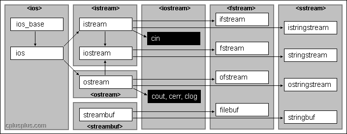

# IO

C++标准库提供的IO操作涉及到的头文件有：`<ios>`、`<istream>`、`<ostream>`、`<streambuf>`、`<iostream>`、`<fstream>`、`<sstream>`。

## ✏ 类结构

C++标准库中一共有三种IO类，标准输入输出\(`iostream`\)，文件输入输出\(`fstream`\)，字符串输入输出\(`sstream`\)，具体类型如下图，其中以`w`开头的类型是宽字符版本，`sstream`和`fstream`继承自`iostream`，所以这些类型之间有着共同的特性。



* `ios_base`：表示流的基本特征；
* `ios`：继承于`ios_base`，提供了一个指向`streambuf`的指针；
* `streambuf`：为缓冲区提供了内存，并提供了用于操作缓冲区的方法; 
* `istream/wistream`：继承于`ios`类，提供了输入方法；
* `ostream/wostream`：继承于`ios`类，提供了输出方法；
* `iostream/wiostream`：继承于`istream`和`ostream`，提供了输入输出方法；
* `ifstream/wifstream`：继承于`istream`，提供了对文件进行输入的方法；
* `ofstream/wofstream`：继承于`ostream`，提供了对文件进行输出的方法；
* `fstream/wfstream`：继承于`iostream`，提供了对文件进行输入输出的方法；
* `istringstream/wistringstream`：继承于`istream`，对字符串进行操作的输入流类；
* `ostringstream/wostringstream`：继承于`ostream`，对字符串进行操作的输出流类；
* `stringstream/wstringstream`：继承于`iostream`，对字符串进行操作的输入输出流类。

## ✏ 标准IO

### 🖋 1、常见IO对象

C++中标准库提供了四个标准IO对象:

1. `cin`：标准输入流对象,默认情况下关联到标准输入设备\(键盘\)。 
2. `cout`：标准输出流对象，默认情况下关联到标准输出设备\(显示器\)。 
3. `clog`：表示错误的标准输出流对象，默认情况下关联到标准输出设备\(显示器\)。 
4. `cerr`：用于日志记录的标准输出流对象，默认情况下关联到标准输出设备\(显示器\)。该流未被缓冲，这意味这信息将直接发送给屏幕，而不是等到缓冲区中填满数据或有新的换行符才会发送。 

> 实际上应有8个对象，针对宽字符`wchar_t`，以上4个对象都有对应的处理`wchar_t`的对象。

#### 🖌 1.1、IO对象无拷贝或赋值

流对象不能存储在vector或其他容器中。形参或返回类型也不能为流类型，如果需要，则必须传递或返回指向该对象的指针或引用，而且不能是`const`引用，因为读写一个IO对象会改变其状态。

#### 🖌 1.2、IO条件状态

将流作为条件使用，只能知道流是否有效。IO 库定义了一个与机器无关的 `iostate` 类型，它提供了表达流状态的完整功能。这个类型应作为一个位集合来使用 \(即一个数的二进制每个位来表示对应的标志位\)。通常与位运算一起使用来一次性检测或设置多个标志位。

**IO类有5个状态标志位：**

```cpp
enum _Iostate { _Statmask = 0x17 }; // constants for stream states

static constexpr _Iostate goodbit = (_Iostate)0x0;
static constexpr _Iostate eofbit = (_Iostate)0x1;
static constexpr _Iostate failbit = (_Iostate)0x2;
static constexpr _Iostate badbit = (_Iostate)0x4;
```

1. `strm::iostate` ：一种机器相关的枚举类型，提供**表达条件状态的完整功能**。
2. `strm::badbit` ：标识流已经崩溃，无法挽回。
3. `strm::failbit`：用来标识一个IO操作失败了。
4. `strm::eofbit`：操作到达文件末尾时，设置此标记位；
5. `strm::goodbit`：用来指出流未处于错误状态，此值保证为0。

`strm`是一种IO类型，`failbit、badbit、eofbit`组成了流状态，如果 `badbit`、`failbit` 和 `eofbit` 任一个被置位，则检测流状态的条件会失败， 若在输入输出类里，需要加`ios::`标识符号。

#### \*\*\*\*🖌 1.3、**查询条件状态：**

1. `s.eof()` ：若流 s 的`eofbit`置位，返回`true`
2. `s.fail()` ：若流 s 的`failbit`或`badbit`置位，返回`true`
3. `s.bad()` ：若流 s 的`badbit`置位，返回`true`
4. `s.good()` ：若流s处于有效状态，返回`true`

> Note：`badbit`被置位时，成员函数`fail()`也会返回`ture`，`eofbit`置位会导致`failbit`置位，需要注意的是，`eofbit`在读取完最后一个字符后并没有置位，当下次尝试读取一个字符失败的时候才会将`eofbit`和`failbit`置位，所以用成员函数`fail()`或`good()`来确定流的总体状态是正确的。 单独执行`cin.setatate(ios::eofbit)`时，`cin.fail()`函数**不会**返回`1`；单独执行`cin.setstate(ios::badbit)`时，`cin.fail()`和`cin.bad()`都会返回`1`；

#### \*\*\*\*🖌 1.4、**管理条件状态：** ​ 

流对象的 `rdstate()` 成员返回一个`iostate` 值，对应流的当前状态。`setstate` 操作将给定条件位置位，表示发生了对应错误。`clear()` 不接受参数的版本复位所有错误标志位。执行 `clear()` 后，调用 `good()` 会返回 `true`。

1. `s.clear()` ：将流 s 中所有的条件状态位复位，将流的状态设置为有效，返回`void`
2. `s.clear(flags)` ：根据给定的`flags`标志位，将流 s 的对应条件状态位复位，`flags`的可选值有`ios::badbit` `ios::failbit` `ios::eofbit`，返回`void`
3. `s.setstate(flags)` ：根据给定的`flags`标志位，将流 s 中对应的条件状态位置位，`flags`类型为`strm::iostate` ，可以用`setstate(ios::goodbit)`重设流有效状态。返回`void`
4. `s.rdstate()` 返回流 s 当前的条件状态， 是所有**有效标志位常量**之和，返回值类型为 `strm::iostate`

我们可以这样使用这些成员：

```cpp
auto old_state = cin.rdstate();		// 记住 cin 的当前状态
cin.clear();						          // 使 cin 有效
process_input(cin);					      // 使用 cin
cin.setstate(old_state);			    // 将 cin 置位原有状态
```

为了复位单一的条件状态位，我们首先用 `rdstate` 读出当前条件状态，然后用位操作将所需位复位来生成新的状态。例如，下面代码将 `failbit` 和 `badbit` 复位，但保持 `eofbit` 不变：

```cpp
cin.clear(cin.rdstate() & ~cin.failbit & ~cin.badbit);
```

### 🖋 2、输入

> 从键盘输入字符串的时候需要敲一下回车键才能够将这个字符串送入到缓冲区中，那么敲入的这个回车键\(`\r`\)会被转换为一个换行符`\n`，这个换行符`\n`也会被存储在`cin`的缓冲区中并且被当成一个字符来计算。`cin`读取数据是从输入缓冲区中获取数据，缓冲区为空时，`cin`的成员函数会阻塞等待数据的到来，一旦缓冲区中有数据，就触发`cin`的成员函数去读取数据。

#### \*\*\*\*🖌 2.1、**使用`cin`进行读取输入，常用的读取方法有:**

* `operator >>`：用于读取满足参数的类型\(基本数据类型都可以\)，读取时将忽略空白符号；

当`cin>>`从缓冲区中读取数据时，若缓冲区中第一个字符是空格、`tab`或换行这些分隔符时，`cin>>`会将其忽略并清除，继续读取下一个字符，若缓冲区为空，则继续等待。但是如果读取成功，字符后面的分隔符是残留在缓冲区的，`cin>>`不做处理。不想略过空白字符，可以使用 `noskipws` 流控制。比如`cin >> noskipws >> input`。

* `int get()`：读取单个字符，读取到文件尾时，返回`EOF`；
* `istream& get(char& c)`：读取单个字符到c，读取到文件尾时，返回false；
* `istream& get(char s, streamsize n)`：用于读取C风格字符串，它不会丢弃换行符，换行符将继续留在输入缓冲区中，因此接下来的输入操作首先将读取换行符；
* `istream& get(char* s, streamsize n, char delim)`：同上，但可指定结束符；
* `istream& get(streambuf& sb)`；
* `istream& get(streambuf& sb, char delim)`；

> 其中`streamsize` 在`VC++`中被定义为long long型。

* `istream& getline(char s, streamsize n)`：用于读取C风格字符串，通过换行符来确定行尾，但不保存换行符，而是将换行符用空字符来替换；
* `istream& getline(char* s, streamsize count, char delim)`；

`cin.getline`与`cin.get`的区别是，`cin.getline`不会将结束符或者换行符残留在输入缓冲区中。`cin>>`对缓冲区中的第一个换行符视而不见，采取的措施是忽略清除，继续阻塞等待缓冲区有效数据的到来。但是，`getline()`读取数据时，并非像`cin>>`那样忽略第一个换行符，`getline()`发现`cin`的缓冲区中有一个残留的换行符，不阻塞请求键盘输入，直接读取，送入目标字符串后，再将换行符替换为空字符`'\0'`。

#### 🖌 2.2、输入错误时的处理

如前所述，`ios_base`中包含一个用来描述流状态的数据成员，由3个标记位组成：

* `ios_base::eofbit`：当`cin`操作到达文件末尾时，设置此标记位；
* `ios_base::failbit`：当`cin`未能读取到预期字符时，设置此标记位；
* `ios_base::badbit`：当存在无法诊断的失败破坏流时，设置此标记位。

以上任何一个如果被设置，那么流将对后面的输入/输出关闭，直到位被清除。`clear()`方法负责重置标记位。 

```cpp
int score;
for (int i=0;i < 10;i++) {
    std::cout << "please enter your score: ";
    while(!(std::cin >> score)){
        std::cin.clear(); //clear state bit
        while(std::cin.get() != '\n') { // 清空输入队列中的错误字符
            continue;
        }
        std::cout << "please enter a number: ";
        continue;
    }
    std::cout << "your score: " << score << std::endl;
}
// 当输入数据不能转换为int时读操作就会失败，cin的failbit就会置位。
// 6-8行，如果不清空错误字符，4行的while会一直进入。
```

#### 🖌 2.3、清空输入缓冲区

上一次的输入操作很有可能使输入缓冲区中残留数据，影响下一次的输入。所以需要对输入缓冲区进行清空和条件状态的复位。条件状态的复位使用`clear()`，清空输入缓冲区应该使用`ignore()`：  
函数原型：`istream &ignore(streamsize num=1, int delim=EOF);`  
函数作用：跳过输入流中n个字符，或在遇到指定的终止字符时提前结束（此时跳过包括终止字符在内的若干字符）。

```cpp
char str1[20]={NULL},str2[20]={NULL};
std::cin.getline(str1,5);
std::cin.clear();  // 清除错误标志
std::cin.ignore(std::numeric_limits<std::streamsize>::max(),'\n'); //清除缓冲区的当前行
std::cin.getline(str2,20);
std::cout<<"str1:"<<str1<<std::endl;
std::cout<<"str2:"<<str2<<std::endl;

> 3421132
  ahfdkjahskj
  str1:3421
  str2:ahfdkjahskj
```

**注意：**

1. 程序中使用`cin.ignore()`清空了输入缓冲区的当前行，使上次的输入残留下的数据没有影响到下一次的输入，这就是`ignore()`函数的主要作用。其中，`numeric_limits::max()`不过是头文件定义的流使用的最大值，也可以用一个足够大的整数代替它。如果想清空输入缓冲区，去掉换行符，使用： `cin.ignore(numeric_limits< std::streamsize>::max())`；清除`cin`里所有内容。
2. 当输入缓冲区没有数据时，`cin.ignore()`也会阻塞等待数据的到来。

#### 🖌 2.4、`while(cin >> temp)`的循环问题

《c++ primer》第五版 p280 ：只有当一个流处于无错状态时，才能从他读写数据。在使用流之前，应该检查它的状态，通常用`while`循环来检查。`>>`表达式返回的是流的状态。当`temp`是字符串类型是，是没法通过输入类型错误而让`failbit`置位退出循环的，所以需要通过输入特殊字符结束输入。

在 Windows 系统中，通过键盘输入时，在单独的一行按 Ctrl+Z 键后再按回车键，就代表输入结束。在 UNIX/Linux 系统中，Ctrl+D 代表输入结束。

#### 🖌 2.5、其他输入的方式

**1、`getline`读取一行**

C++中定义了一个在std名字空间的全局函数`getline()`，因为这个函数的参数使用了`string`字符串，所以声明在了`<string>`头文件中。`getline()`利用`cin`可以从标准输入设备键盘读取一行，当遇到如下三种情况会结束读操作：1）到文件结束；2）遇到函数的定界符；3）输入达到最大限度。

函数原型有两个重载形式：

```cpp
istream& getline(istream& is, string& str);  //默认以换行符结束
istream& getline(istream& is, string& str, char delim);
```

### 🖋 3、输出

#### 🖌 3.1、**使用`cout`进行输出时，常用的输出方法有:**

`ostream`类中对`<<`运算符做了重载，用来进行输出。除此之外，还有两个方法:

* `ostream& put(char c)`：向输出流中插入一个字符；
* `ostream& write(const char* s, streamsize n)`：将 s 指向的数组的前 n 个字符插入到流中；

#### 🖌 3.2、管理输出缓冲

每个输出流都管理一个缓冲区，缓冲区的存在可以使多次写操作合并为一次，从而提高性能，只有在缓冲区刷新的时候才真正的写到设备或文件。下列情况下缓冲区被刷新：

* 程序正常结束，作为 `main` 函数的 `return` 操作的一部分，缓冲刷新被执行。 
* 缓冲区满时，需要刷新缓冲，而后新的数据才能继续写入缓冲区 
* 可以使用操纵符如 `endl` 来显示刷新缓冲区 
* 在每个输出操作之后，可以用操纵符 `unitbuf` 设置流的内部状态，来清空缓冲区。默认情况下，对 `cerr` 是设置 `unitbuf` 的，因此写到 `cerr` 的内容都是立即刷新的 
* 一个输出流可能被关联到另一个流。在这种情况下，当读写被关联的流时，关联到的流的缓冲区会被刷新。例如，默认情况下，`cin` 和 `cerr`都关联到 `cout`。因此，读 `cin` 或写 `cerr` 都会导致 `cout` 的缓冲区被刷新。 

1、`cout`进行输出时，并非直接输出到显示器，而是先输出到缓冲区，再由缓冲区刷新到显示器。`ostream`类提供了两个控制符可以进行强制刷新缓冲区：

* `flush`:刷新缓冲区；
* `endl`:刷新缓冲区，并且插入一个换行符号；

```cpp
std::cout << "hello,world" << std::endl; //输出hello,world和一个换行，然后刷新缓冲区
std::cout << "hello,world" << std::flush;//输出hello,world，然后刷新缓冲区
std::cout << "hello,world" << std::ends; //输出hello,world和一个空字符，然后刷新缓冲区
```

2、可以使用操纵符`unitbuf`设置流的内部状态，使任何输出都立即刷新，无缓冲。警告：如果程序崩溃，输出缓冲区不会被刷新。

```cpp
std::cout << std::unitbuf;   //所有输出操作立即刷新缓冲区
std::cout << "hello,world";
std::cout << std::nounitbuf; //回到正常的缓冲方式
```

3、当一个输入流被关联到一个输出流的时候，任何试图从输入流读取数据的操作都会先刷新关联的输出流，例如`cin`和`cout`。

```cpp
std::ostream* out1 = std::cin.tie();//获取cin关联的输出流
*out1 << out1 << std::endl;
std::cin.tie(out1);                 //关联cin和cout
```

`tie` 有两个重载的版本：第一个版本不带参数，返回指向输出流的指针。如果本对象当前关联到一个输出流，则返回的就是指向这个流的指针，如果对象未关联到流，则返回空指针。`tie` 的第二个版本接受一个指向 `ostream` 的指针，将自己关联到此 `ostream`。即，`x.tie(&o)` 将流 `x` 关联到输出流 `o`。

​ 我们既可以将一个 `istream` 对象关联到另一个`ostream`，也可以将一个 `ostream` 关联到另一个 `ostream`：

```cpp
std::cin.tie(&cout);				// 仅仅用来展示：将 cin 和 cout 关联在一起
// old_tie 指向当前关联到 cin 的流 (如果有的话)
std::ostream *old_tie = std::cin.tie(nullptr);		// cin 不再与其他流关联
std::cin.tie(&cerr);				// 将 cin 与 cerr 关联；cin 应该关联到 cout，这不是一个好主意
std::cin.tie(old_tie);			// 重建 cin 与 cout 的关联
```

在这段代码中，为了将一个给定的流关联到一个新的输出流，我们将新流的指针传递给了 `tie`。为了彻底解开流的关联，我们传递了一个空指针。每个流同时最多关联一个流，但多个流可以同时关联到同一个 `ostream`。 

#### 🖌 3.3、格式化输出

**3.3.1、修改进制**

`cout` 默认十进制输出，可通过如下方式修改:

* `cout << hex`:十六进制输出
* `cout << oct`:八进制输出
* `cout << dec`:十进制输出\(默认\)

**3.3.2、调整字符宽度、填充字符**

`ostream`类的成员函数`width`用来设置宽度:

```cpp
streamsize width() const;          //get
streamsize width(streamsize wide); //set
```

`width`只影响下一个显示的内容，然后字段宽度恢复为默认值。

```cpp
char ch = '#';
std::cout << ch << std::endl;
std::cout.width(10);//设置宽度为10
std::cout.fill('*');//填充宽度中为被使用的部分
std::cout << ch << std::endl;
std::cout << ch << std::endl;

> #
  *********#
  #
```

**3.3.3、修改浮点数精度** 

c++中浮点数默认精度为6，但不打印末尾的0，可通过成员函数`precision()`设置：

```cpp
streamsize precision() const;          //get 
streamsize precision(streamsize prec); //set
```

与`width()`不同，新的精度将一直有效。

**3.3.4、`setf()`成员函数设置格式和控制符**

`ios_base`中提供了许多的标记可以用来进行格式化，将这些标记作为函数`setf()`的参数就可以设置对应的格式了。

```cpp
fmtflags setf(fmtflags fmtfl);   //设置新标记，返回原来标记的设置 
fmtflags setf(fmtflags fmtfl, fmtflags mask);
```

比如常用的控制数字和字符的标记：

| 常量 | 含义 |
| :---: | :---: |
| `ios_base::showpoint` | 显示末尾的小数点 |
| `ios_base::boolalpha` | 输入/输出对应的bool值 |
| `ios_base::showbase` | 输出时使用基数前缀 |

```cpp
int i = 0;
cout.setf(ios_base::showpoint|ios_base::boolalpha);
cout << i << endl;
/*输出: false而不是0*/
```

使用`setf()`并不是进行格式化最好的方法，C++还提供了和每个标记对应的控制符，来直接调用`setf()`，如：

| 控制符 | 调用 |
| :---: | :---: |
| `std::showpoint` | `setf(ios_base::showpoint)` |
| `std::boolalpha` | `setf(ios_base::boolalpha)` |
| `std::showbase` | `setf(ios_base::showbase)` |

```cpp
int i = 0;
cout << boolalpha << i << endl;
```

 更多的格式化标记请参考API:[std::ios\_base::fmtflags](http://www.cplusplus.com/reference/ios/ios_base/fmtflags/)

**3.3.6、`iomanip`**

头文件`iomanip`中提供了更为方便的方法来进行格式化输出，常用函数有：

* `setbase(int base)`：设置进制；
* `setfill(char_type c)`：设置填充字符；
* `setprecision(int n)`：设置精度；
* `setw(int n)`：设置宽度；
* `setiosflags(ios_base::fmtflags mask)`：设置`ios_base`中提供的标记。

```cpp
double d = 2.3333675;
char c = '#';
std::cout << std::setw(10);       //width
std::cout << std::setfill('*');   //fill
std::cout << c << std::endl;
std::cout << std::setprecision(3);//precision
std::cout << d << std::endl;
std::cout << std::setiosflags(std::ios_base::showpos); 
std::cout << d << std::endl;

> *********#
  2.33
  +2.33
```

## ✏ 文件IO

## ✏ 字符串IO


