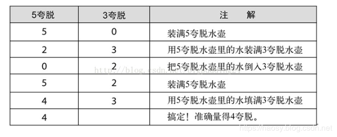

# 智力题

###  🖋1、 **“火柴棍式”**

下面是一个C程序，其想要输出20个减号，不过，粗心的程序员把代码写错了，你需要把下面的代码修改正确，不过，你只能增加或是修改其中的一个字符，请你给出三种答案。

```cpp
int n = 20;
for(int i = 0; i < n; i--){
    printf("-");
}
```

**答案：**

```cpp
//第一种解法：在for循环中给 i 加一个负号
for(int i = 0; -i < n; i--)
//第二种解法：在for循环中把 i-- 变成 n--
for(int i = 0; i < n; n--)
//第三种解法：把for循环中的 < 变成 +
for(int i = 0; i + n; i--)
```

通过修改或增加一个字符，让其输出21个减号（补码）

```cpp
for(int i = 0; ~i < n; i--)
```

通过修改或增加一个字符，让其不输出减号

```cpp
for(int i = 0; i << n; i--)

for(int i = 0; i < -n; i--)

for(int i = 0; i < ~n; i--)

for(int i = 0; i < !n; i--)

int n = 0;
for(int i = 20; i < n; i--)
```

### 🖋 2、**火车运煤问题**

你是山西的一个煤老板，你在矿区开采了有3000吨煤需要运送到市场上去卖，从你的矿区到市场有1000公里，你手里有一列烧煤的火车，这个火车最多只能装1000吨煤，且其能耗比较大——每一公里需要耗一吨煤。请问，作为一个懂编程的煤老板的你，你会怎么运送才能运最多的煤到集市？

**答案：**

1. 装1000吨煤，走250公里，扔下500吨煤，回矿山。
2. 装1000吨煤，走到250公里处，拿起250吨煤继续向前到500公里处，扔下500吨煤，回矿山。此时火车上还有250吨，再加上在250公里处还有250吨煤，所以，火车是可以回矿山的。
3. 装上最后1000吨煤，走到500公里处，装上那里的500吨煤，然后一直走到目的。

### 🖋 3、倒水

有两个水壶，容量分别为5夸脱（美制：1夸脱=0.946升，英制：1夸脱=1.136升）和3夸脱，若水的供应不限量（但没有量杯），怎么用这两个水壶得到刚好4夸脱的水？注意，这两个水壶呈不规则形状，无法精准地装满“半壶”水。



只要这两个水壶的容量互质（即两个数没有共同的质因子），我们就能找出一种倒水的顺序组合，量出1到2个水壶容量总和（含）之间的任意水量。

### 🖋 4、柜子状态

走廊上有100个关上的储物柜。有个人先是将100个柜子全都打开。接着，每隔一个柜子关上一个。然后，在第三轮时，再每隔两个就切换第三个柜子的开关状态（也就是将关上的柜子打开，将打开的关上）。照此规律反复操作100次，在第 i 轮，这个人会每数 i 个就切换第 i 个柜子的状态。当第100轮经过走廊时，只切换第100个柜子的开关状态，此时有几个柜子是开着的？ 

解法：要解决这个问题，我们必须弄清楚所谓切换储物柜开关状态是什么意思。这有助于我们推断最终哪些柜子是开着的。

1. 问题：柜子会在哪几轮切换状态（开或关）？ 柜子n会在n的每个因子（包括1和n本身）对应的那一轮切换状态。也就是说，柜子15会在第1、3、5和15轮开或关一次。（i=1开，3关，5开，15关。因子个数：偶数关，奇数开）
2. 问题：柜子什么时候还是开着的？ 如果因子个数（记作x）为奇数，则这个柜子是开着的。你可以把一对因子比作开和关，若还剩一个因子，则柜子就是开着的。 
3. 问题：x什么时候为奇数？ 若n为完全平方数，则x的值为奇数。理由如下：将n的两个互补因子配对。例如，如n为36，则因子配对情况为：\(1, 36\)、\(2, 18\)、\(3, 12\)、\(4, 9\)、\(6, 6\)。注意，\(6, 6\)其实只有一个因子，因此 n 的因子个数为奇数。 
4. 问题：有多少个完全平方数？ 一共有10个完全平方数（1、4、9、16、25、36、49、64、81、100）， 因此，最后共有10个柜子是开着的。

### 🖋 5、疯狗问题

### 🖋 6、药丸问题

### 🖋 7、赛马问题

