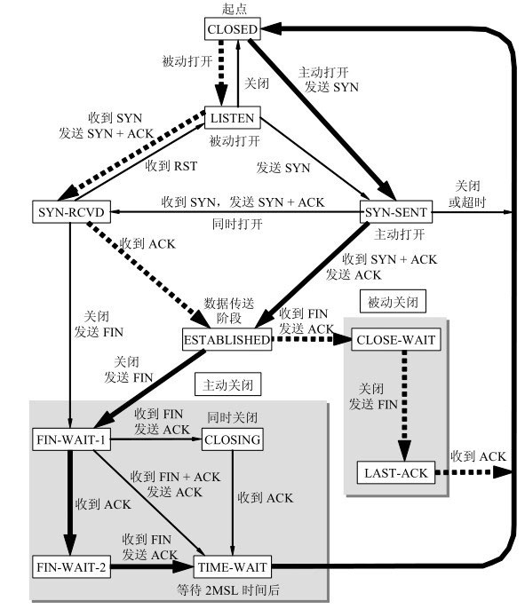

# TCP/UDP

## ✏ `TCP` 协议

`TCP`\(`Transmission Control Protocol` 传输控制协议\)是一种面向连接\(连接导向\)的、可靠的、 基于`IP`的传输层协议。

### 🖋 1、特点

`TCP`是`TCP/IP`体系中非常复杂的一个协议，`TCP`最主要的特点有：

1. `TCP`是面向连接的运输层协议。应用程序在使用`TCP`协议之前，必须先建立`TCP`连接。在传递数据完毕后，必须释放已建立的`TCP`连接。
2. 每一条`TCP`连接只能有两个端点，即`TCP`是点对点的。
3. `TCP`提供可靠交付的服务，通过`TCP`连接传送的数据，无差错，不丢失，不重复，并且按序到达。
4. `TCP`提供全双工通信。`TCP`允许通信双方的应用进程在任何时候都能发送数据。`TCP`连接的两端都设有发送缓存和接收缓存，用来临时存放双向通信的数据。
5. 面向字节流。`TCP`中的“流”指的是流入到进程或从进程流出的字节序列。“面向字节流”的含义是：虽然应用程序和`TCP`的交互是一次一个数据块\(大小不等\)，但`TCP`把应用程序交下来的数据看成仅仅是一连串的无结构的字节流。`TCP`并不知道所传送的字节流的含义。`TCP`不保证接收方应用程序所收到的数据块和发送方应用程序所发出的数据块具有对应大小的关系。但接收方应用程序收到的字节流必须和发送方应用程序发出的字节流完全一样。当然，接收方的应用程序必须有能力识别收到的字节流，把它还原成有意义的应用层数据。

`TCP`协议重点解决的问题：顺序问题，稳重不乱；丢包问题，承诺靠谱；连接维护，有始有终；流量控制，把握分寸；拥塞控制，知进知退。

### 🖋 2、 **`TCP`包头格式**


`TCP`把连接作为最基本的抽象，每个`TCP`连接有两个端点：

1. 源端口号和目标端口号是不可少的，各占2个字节，这两个值加上IP首部中的源端IP地址和目的端IP地址唯一确定一个`TCP`连接。
2. 包的序号：占4个字节，是本报文段所发送的数据项目组第一个字节的序号。在`TCP`传送的数据流中，每一个字节都有一个序号。例如，一报文段的序号为300，而且数据共100字节，则下一个报文段的序号就是400；序号是`32bit`的无符号数，序号到达 $$2^{32}-1$$ 后从0开始。这个序列号（序列码）可用来补偿传输中的不一致。当`SYN`出现，序列码实际上是初始序列码（`Initial Sequence Number，ISN`），而第一个数据字节是`ISN+1`。
3. 确认序号：占4字节，是期望收到对方下次发送的数据的第一个字节的序号，也就是期望收到的下一个报文段的首部中的序号；确认序号应该是上次已成功收到数据字节序号+1。只有`ACK`标志为1时，确认序号才有效。
4. 数据偏移：占4比特，表示数据开始的地方离`TCP`段的起始处有多远。实际上就是`TCP`段首部的长度。由于首部长度不固定，因此数据偏移字段是必要的。数据偏移以32位为长度单位，也就是4个字节，因此`TCP`首部的最大长度是60个字节。即偏移最大为`15个长度单位=15x32位=15x4字节`。
5. 保留：6比特，供以后应用，现在置为0。
6. 状态位：

   > ① `URG`：当`URG=1`时，注解此报文应尽快传送，而不要按本来的列队次序来传送。与“紧急指针”字段共同应用，紧急指针指出在本报文段中的紧急数据的最后一个字节的序号，使接管方可以知道紧急数据共有多长。
   >
   > ② `ACK`：只有当`ACK=1`时，确认序号字段才有效；
   >
   > ③ `PSH`：当`PSH=1`时，接收方应该尽快将本报文段立即传送给其应用层。在处理Telnet或rlogin等交互模式的连接时，该标志总是置位的。
   >
   > ④ `RST`：当`RST=1`时，表示出现连接错误，必须释放连接，然后再重建传输连接。复位比特还用来拒绝一个不法的报文段或拒绝打开一个连接；
   >
   > ⑤ `SYN`：`SYN=1`，`ACK=0`时表示请求建立一个连接，携带`SYN`标志的`TCP`报文段为同步报文段；
   >
   > ⑥ `FIN`：发端完成发送任务。

7. 窗口：`TCP`通过滑动窗口的概念来进行流量控制。设想在发送端发送数据的速度很快而接收端接收速度却很慢的情况下，为了保证数据不丢失，显然需要进行流量控制， 协调好通信双方的工作节奏。所谓滑动窗口，可以理解成接收端所能提供的缓冲区大小。`TCP`利用一个滑动的窗口来告诉发送端对它所发送的数据能提供多大的缓冲区。窗口大小为字节数起始于确认序号字段指明的值（这个值是接收端正期望接收的字节）。窗口大小是一个`16bit`字段，因而窗口大小最大为65535字节。
8. 检验和：检验和覆盖了整个`TCP`报文段：`TCP`首部和数据。这是一个强制性的字段，一定是由发端计算和存储，并由收端进行验证。
9. 紧急指针：只有当`URG`标志置1时紧急指针才有效。紧急指针是一个正的偏移量，和序号字段中的值相加表示紧急数据最后一个字节的序号。
10. 选项：长度不定，但长度必须为1个字节。如果没有选项就表示这个1字节的域等于0。为了对齐，填充三个字节，因此`TCP`首部至少24个字节。

### 🖋 3、`TCP`连接和释放

#### 🐹 3.1、`TCP`连接三次握手

所谓三次握手（Three-Way Handshake）即建立`TCP`连接，就是指建立一个`TCP`连接时，需要客户端和服务端总共发送3个包以确认连接的建立。在`socket`编程中，这一过程由客户端执行`connect`来触发，整个流程如下图所示：


一开始，客户端和服务端都处于`CLOSED`状态，先是服务端主动监听某个端口，处于`LISTEN`状态。

（1）第一次握手：`Client`将标志位`SYN`置为1，随机产生一个值`seq=J`，并将该数据包发送给`Server`，`Client`进入`SYN_SENT`状态，等待`Server`确认。**`TCP`规定，SYN报文段（SYN=1的报文段）不能携带数据，但需要消耗掉一个序号。**

（2）第二次握手：`Server`收到数据包后由标志位`SYN=1`知道`Client`请求建立连接，`Server`将标志位`SYN`和`ACK`都置为1，`ack=J+1`，随机产生一个值`seq=K`，并将该数据包发送给`Client`以确认连接请求，`Server`进入`SYN_RCVD`状态。**这个报文也不能携带数据，但是同样要消耗一个序号。**

（3）第三次握手：`Client`收到确认后，检查`ack`是否为J+1，`ACK`是否为1，如果正确则将标志位`ACK`置为1，`ack=K+1`，并将该数据包发送给`Server`，`Server`检查`ack`是否为`K+1`，`ACK`是否为1，如果正确则连接建立成功，`Client`和`Server`进入`ESTABLISHED`状态，完成三次握手，随后`Client`与`Server`之间可以开始传输数据了。**`TCP`规定，`ACK`报文段可以携带数据，但是如果不携带数据则不消耗序号。**

> 初始序列号：`tcp`初始序列号是随机的。由于A和B之间的一个`tcp`连接通常是由A和B的2个`ip`地址，2个端口号构成的四元组，因此当A出现了故障把这个`tcp`连接断开了，之后再以相同的四元组建立新的`tcp`连接（也就是说A和B两次建立`tcp`连接都是使用了相同的`ip`地址和端口），就会出现数据乱序的问题。
>
> 用`wireshark`查看数据包，3次握手的数据包的初始序列号seq总是0，其实是`wireshark`进行了处理，为了更友好的显示。在鼠标右键“Protocol Preference”菜单中去掉“`Analyze TCP sequeuece numbers`”，就可以看到真实的序号了。

> **SYN攻击**：
>
> 在三次握手过程中，Server发送`SYN-ACK`之后，收到`Client`的`ACK`之前的`TCP`连接称为半连接（half-open connect），此时Server处于`SYN_RCVD`状态，当收到`ACK`后，Server转入`ESTABLISHED`状态。SYN攻击就是Client在短时间内伪造大量不存在的IP地址，并向Server不断地发送`SYN`包，Server回复确认包，并等待Client的确认，由于源地址是不存在的，因此，Server需要不断重发直至超时，这些伪造的`SYN`包将产时间占用未连接队列，导致正常的SYN请求因为队列满而被丢弃，从而引起网络堵塞甚至系统瘫痪。SYN攻击时一种典型的`DDOS`攻击，检测SYN攻击的方式非常简单，即当Server上有大量半连接状态且源IP地址是随机的，则可以断定遭到SYN攻击了，使用如下命令可以让之现行：

> ```text
> netstat -nap | grep SYN_RECV
> ```

#### 🐹 3.2、`TCP`释放连接

所谓四次挥手（`Four-Way Wavehand`）即终止`TCP`连接，就是指断开一个`TCP`连接时，需要客户端和服务端总共发送4个包以确认连接的断开。在`socket`编程中，这一过程由客户端或服务端任一方执行`close`来触发，整个流程如下图所示：


由于`TCP`连接时全双工的，因此，每个方向都必须要单独进行关闭，这一原则是**当一方完成数据发送任务后，发送一个FIN来终止这一方向的连接，收到一个`FIN`只是意味着这一方向上没有数据流动了，即不会再收到数据了，但是在这个`TCP`连接上仍然能够发送数据，直到这一方向也发送了`FIN`。**首先进行关闭的一方将执行主动关闭，而另一方则执行被动关闭，

当前客户端和服务端都处于`ESTAB-LISHED`状态。

（1）第一次挥手：Client发送一个`FIN`，用来关闭`Client`到`Server`的数据传送，Client进入`FIN_WAIT_1`状态。释放数据报文首部，`FIN=1`，其序列号为`seq=u`（等于前面已经传送过来的数据的最后一个字节的序号加1）。**`TCP`规定，FIN报文段即使不携带数据，也要消耗一个序号。**

（2）第二次挥手：Server收到`FIN`后，发送一个`ACK`给Client，`ack=u+1`（与SYN相同，一个`FIN`占用一个序号），并且带上自己的序列号`seq=v`，Server进入`CLOSE_WAIT`状态。**`TCP`服务器通知高层的应用进程，客户端向服务器的方向就释放了，这时候处于半关闭状态，即客户端已经没有数据要发送了，但是服务器若发送数据，客户端依然要接受。**这个状态还要持续一段时间，也就是整个`CLOSE-WAIT`状态持续的时间。客户端收到服务器的确认请求后，此时，客户端就进入`FIN-WAIT-2`（终止等待2）状态，等待服务器发送连接释放报文（在这之前还需要接受服务器发送的最后的数据）。

（3）第三次挥手：服务器将最后的数据发送完毕后，Server发送一个`FIN`，用来关闭Server到Client的数据传送，Server进入`LAST_ACK`状态。释放报文首部，`FIN=1`，`ack=u+1`，由于在半关闭状态，服务器很可能又发送了一些数据，假定此时的序列号为`seq=w`。

（4）第四次挥手：Client收到`FIN`后，Client进入`TIME_WAIT`状态，接着发送一个`ACK`给Server，`ack=w+1`，而自己的序列号是`seq=u+1`，注意此时`TCP`连接还没有释放，必须经过`2∗MSL`（最长报文段寿命）的时间后，当Client撤销相应的`TCB`后，才进入`CLOSED`状态。Server只要收到了Client发出的确认，立即进入`CLOSED`状态。同样，撤销`TCB`后，就结束了这次的`TCP`连接。可以看到，服务器结束`TCP`连接的时间要比客户端早一些。

#### 🐹 3.3、问题分析

❓ **3.3.1、为什么`TCP`客户端最后还要发送一次确认呢？即为什么不是两次握手？**

> 一句话，主要防止已经失效的连接请求报文突然又传送到了服务器，从而产生错误。 如果使用的是两次握手建立连接，假设有这样一种场景，客户端发送了第一个请求连接并且没有丢失，只是因为在网络结点中滞留的时间太长了，由于`TCP`的客户端迟迟没有收到确认报文，以为服务器没有收到，此时重新向服务器发送这条报文，此后客户端和服务器经过两次握手完成连接，传输数据，然后关闭连接。此时此前滞留的那一次请求连接，网络通畅了到达了服务器，这个报文本该是失效的，但是，两次握手的机制将会让客户端和服务器再次建立连接，这将导致不必要的错误和资源的浪费。
>
> 如果采用的是三次握手，就算是那一次失效的报文传送过来了，服务端接受到了那条失效报文并且回复了确认报文，但是客户端不会再次发出确认。由于服务器收不到确认，就知道客户端并没有请求连接。

❓ **3.3.2、为什么建立连接是三次握手，而关闭连接却是四次挥手呢？**

> “先关读，再关写”：建立连接的时候， 服务器在`LISTEN`状态下，收到建立连接请求的`SYN`报文后，把`ACK`和`SYN`放在一个报文里发送给客户端。 而关闭连接时，服务器收到对方的FIN报文时，仅仅表示对方不再发送数据了但是还能接收数据，而自己也未必全部数据都发送给对方了，所以己方可以立即关闭， 也可以发送一些数据给对方后，再发送FIN报文给对方来表示同意现在关闭连接，因此，己方`ACK`和`FIN`一般都会分开发送，从而导致多了一次。

❓ **3.3.3、为什么TIME\_WAIT状态需要经过`2MSL`\(最大报文段生存时间\)才能返回到CLOSE状态？**

> **MSL（Maximum Segment Lifetime\)**，`TCP`允许不同的实现可以设置不同的`MSL`值。
>
> 第一，保证客户端发送的最后一个`ACK`报文能够到达服务器，因为这个`ACK`报文可能丢失，站在服务器的角度看来， 我已经发送了`FIN+ACK`报文请求断开了，客户端还没有给我回应，应该是我发送的请求断开报文它没有收到， 于是服务器又会重新发送一次，而客户端就能在这个`2MSL`时间段内收到这个重传的报文，接着给出回应报文，并且会重启`2MSL`计时器。
>
> 第二，防止类似与“三次握手”中提到了的“已经失效的连接请求报文段”出现在本连接中。客户端发送完最后一个确认报文后， 在这个`2MSL`时间中，就可以使本连接持续的时间内所产生的所有报文段都从网络中消失。这样新的连接中不会出现旧连接的请求报文。

### 🖋 4、`TCP`状态机



以字节为单位的滑动窗口：


在`TCP`里，接收端\(B\)会给发送端\(A\)报一个窗口的大小，叫`Advertised window`。

1.在没有收到B的确认情况下，A可以连续把窗口内的数据都发送出去。凡是已经发送过的数据，在

未收到确认之前都必须暂时保留，以便在超时重传时使用。

2.发送窗口里面的序号表示允许发送的序号。显然，窗口越大，发送方就可以在收到对方确认之前连续

发送更多数据，因而可能获得更高的传输效率。但接收方必须来得及处理这些收到的数据。

3.发送窗口后沿的后面部分表示已发送且已收到确认。这些数据显然不需要再保留了。

4.发送窗口前沿的前面部分表示不允许发送的，应为接收方都没有为这部分数据保留临时存放的缓存空间。

5.发送窗口后沿的变化情况有两种：不动（没有收到新的确认）和前移（收到了新的确认）

6.发送窗口前沿的变化情况有两种：不断向前移或可能不动（没收到新的确认）

### 🖋 5、`TCP`可靠性之包应答序列号

### 🖋 6、`TCP`可靠性之重传机制

### 🖋 7、`TCP`可靠性之流量控制

### 🖋 8、`TCP`可靠性之拥塞控制

