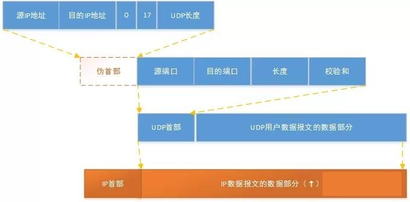
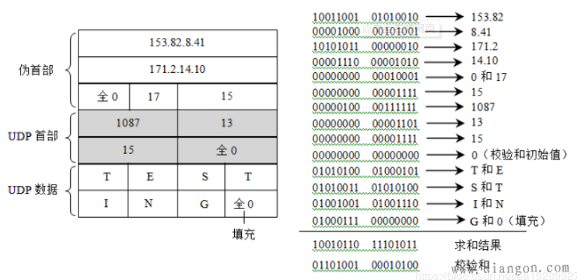

# UDP

 `UDP` 是**`User Datagram Protocol`**的简称， 中文名是**用户数据报协**议，是`OSI`（`Open System Interconnection`，开放式系统互联） 参考模型中一种**无连接的传输层协议**，**传输可靠性没有保证**。`UDP`只是在`IP`的数据报服务之上增加了最基本的服务：复用和分用以及差错检测。

## ✏ 1、`UDP`的特点

`UDP`提供不可靠服务，具有`TCP`所没有的优势：

* `UDP`**无连接**，时间上不存在建立连接需要的时延。空间上，`TCP`需要在端系统中维护连接状态，需要一定的开销。此连接装入包括接收和发送缓存，拥塞控制参数和序号与确认号的参数。`UCP`不维护连接状态，也不跟踪这些参数，开销小。空间和时间上都具有优势。

  > `DNS`如果运行在`TCP`之上而不是`UDP`，那么`DNS`的速度将会慢很多。  
  > `HTTP`使用`TCP`而不是`UDP`，是因为对于基于文本数据的Web网页来说，可靠性很重要。  
  > 同一种专用应用服务器在支持`UDP`时，一定能支持更多的活动客户机。

* **分组首部开销小**，`TCP`首部20字节，`UDP`首部8字节。
* `UDP`**没有拥塞控制**，应用层能够更好的控制要发送的数据和发送时间，网络中的拥塞控制也不会影响主机的发送速率。某些实时应用要求以稳定的速度发送，能容忍一些数据的丢失，但是不能允许有较大的时延（比如实时视频，直播等）。
* `UDP`提供尽**最大努力的交付，不保证可靠交付**。所有维护传输可靠性的工作需要用户在应用层来完成。没有`TCP`的确认机制、重传机制。如果因为网络原因没有传送到对端，`UDP`也不会给应用层返回错误信息。
* `UDP`是**面向报文的**，对应用层交下来的报文，添加首部后直接乡下交付为IP层，既不合并，也不拆分，保留这些报文的边界。对IP层交上来`UDP`用户数据报，在去除首部后就原封不动地交付给上层应用进程，报文不可分割，是`UDP`数据报处理的最小单位。
* > 正是因为这样，`UDP`显得不够灵活，不能控制读写数据的次数和数量。比如我们要发送100个字节的报文，我们调用一次`sendto`函数就会发送100字节，对端也需要用`recvfrom`函数一次性接收100字节，不能使用循环每次获取10个字节，获取十次这样的做法。
* `UDP`常用一次性传输比较少量数据的网络应用，如`DNS`，`SNMP`等，因为对于这些应用，若是采用`TCP`，连接的创建，维护和拆除带来不小的开销。`UDP`也常用于多媒体应用（如IP电话，实时视频会议，流媒体等）数据的可靠传输对他们而言并不重要，`TCP`的拥塞控制会使他们有较大的延迟，也是不可容忍的。
* UDP支持一对一、一对多、多对一和多对多。

## ✏ **2**、`UDP`报文头部

`UDP`头部的标识如下：

1. **16位源端口号：**源主机的应用程序使用的端口号。
2. **16位目的端口号：**目的主机的应用程序使用的端口号。
3. **16位`UDP`长度：**是指`UDP`头部和`UDP`数据的字节长度。因为`UDP`头部长度为8字节，所以该字段的最小值为8。
4. **16位`UDP`校验和：**该字段提供了与`TCP`校验字段同样的功能；该字段是可选的，当源主机不想计算校验和，则直接令该字段全为0。

### 🖋 `UDP`校验

**在计算校验和的时候，需要在`UDP`数据报之前增加12字节的伪首部**，伪首部并不是`UDP`真正的首部。只是在计算校验和，临时添加在`UDP`数据报的前面，得到一个临时的`UDP`数据报。校验和就是按照这个临时的`UDP`数据报计算的。伪首部既不向下传送也不向上递交，而仅仅是为了计算校验和。这样的校验和，既检查了`UDP`数据报，又对IP数据报的源IP地址和目的IP地址进行了检验。

`UDP`校验和的计算方法和IP数据报首部校验和的计算方法相似，都使用二进制反码运算求和再取反。

发送方，首先是把全零放入校验和字段并且添加伪首部，然后把`UDP`数据报看成是由许多16位的子串连接起来，若`UDP`数据报的数据部分不是偶数个字节，则要在数据部分末尾增加一个全零字节（此字节不发送），接下来就按照二进制反码计算出这些16位字的和。将此和的二进制反码写入校验和字段。在接收方，把收到得`UDP`数据报加上伪首部（如果不为偶数个字节，还需要补上全零字节）后，按二进制反码计算出这些16位字的和，当无差错时其结果全为1，否则就表明有差错出现，接收方应该丢弃这个`UDP`数据报。

> 注意： 
>
> 1.校验时，若`UDP`数据报部分的长度不是偶数个字节，则需要填入一个全0字节，但是次字节和伪首部一样，是不发送的。 
>
> 2.如果`UDP`校验和校验出`UDP`数据报是错误的，可以丢弃，也可以交付上层，但是要附上错误报告，告诉上层这是错误的数据报。 
>
> 3.通过伪首部，不仅可以检查源端口号，目的端口号和`UDP`用户数据报的数据部分，还可以检查IP数据报的源IP地址和目的地址。 这种差错检验的检错能力不强，但是简单，速度快。

## ✏ 3、使用`UDP`协议

### \*\*\*\*🖋 3.1、**为什么需要`UDP`？**

**`UDP(User Datagram Protocol)`传输**与**IP传输**非常类似，它的传输方式也是"**Best Effort**"的，所以**`UDP`协议**也是**不可靠**的。`TCP`就是为了解决IP层不可靠的传输层协议，既然`UDP`是不可靠的，**为什么不直接使用IP协议而要额外增加一个`UDP`协议呢**？

1、一个重要的原因是**IP协议中并没有端口\(port\)**的概念。IP协议进行的是IP地址到IP地址的传输，这意味者两台计算机之间的对话。但每台计算机中需要有多个通信通道，并将多个通信通道分配给不同的进程使用。**一个端口就代表了这样的一个通信通道**。`UDP`协议实现了端口，从而让数据包可以在送到IP地址的基础上，进一步可以送到某个端口。

2、**对于一些简单的通信，我们只需要“Best Effort”式的IP传输就可以了**，而不需要`TCP`协议复杂的建立连接的方式\(特别是在早期网络环境中，如果过多的建立`TCP`连接，会造成很大的网络负担，而`UDP`协议可以相对快速的处理这些简单通信）

3、在使用`TCP`协议传输数据时，如果一个数据段丢失或者接收端对某个数据段没有确认，发送端会重新发送该数据段。`TCP`重新发送数据会带来传输延迟和重复数据，降低了用户的体验。**对于迟延敏感的应用，少量的数据丢失一般可以被忽略，这时使用`UDP`传输将能够提升用户的体验**。

### 🖋 3.2、**`UDP`应用场景**

当应用程序**对传输的可靠性要求不高**，但是对**传输速度和延迟要求较高**时，可以用`UDP`协议来替代`TCP`协议在传输层控制数据的转发。

`UDP`适合于**实时数据传输**，如**语音**和**视频通信**，因为它们即使偶尔丢失一两个数据包，也不会对接收结果产生太大影响。

常用的使用`UDP`的协议包括（括号中是默认的端口号）：`TFTP（69）`、`SNMP（161）`、`NFS`、`DNS（53）`、`BOOTP`。

### 🖋 3.3、**可靠性**

**`UDP`协议不可靠，可靠性由谁保障？**

`UDP`将数据从源端发送到目的端时，无需事先建立连接，没有使用`TCP`中的确认技术或滑动窗口机制，因此`UDP`不能保证数据传输的可靠性，也无法避免接收到重复数据的情况。**`UDP`传输的可靠性由应用层负责，**由应用程序根据需要提供报文到达确认、排序、流量控制等功能。

要使用`UDP`来构建可靠的面向连接的数据传输，就要实现类似于`TCP`协议的：

* 超时重传（定时器）【解决报文丢失问题】；
* 有序接受 （添加包序号）【解决包乱序问题】；
* 应答确认 （`Seq/Ack`应答机制）【保证可靠性】；
* 滑动窗口流量控制等机制 （滑动窗口协议）【解决流量控制问题】。

目前已经有一些实现`UDP`可靠传输的机制，比如`UDT`（`UDP-based Data Transfer Protocol`）： 基于`UDP`的数据传输协议，`UDT`是一种互联网数据传输协议。`UDT`的主要目的是支持高速广域网上的海量数据传输，而互联网上的标准数据传输协议`TCP`在高带宽长距离网络上性能很差。 顾名思义，`UDT`建于`UDP`之上，并引入新的拥塞控制和数据可靠性控制机制。`UDT`是面向连接的双向的应用层协议。它同时支持可靠的数据流传输和部分可靠的数据报传输。 由于`UDT`完全在`UDP`上实现，它也可以应用在除了高速数据传输之外的其它应用领域，例如点到点技术（`P2P`），防火墙穿透，多媒体数据传输等等。

### 🖋 **3.4、工作原理**

主机`A`发送数据包时，这些数据包是以**有序的方式**发送到网络中的，每个数据包独立地在网络中被发送，所以**不同的数据包可能会通过不同的网络路径到达主机`B`**。这样的情况下，先发送的数据包不一定先到达主机`B`。因为`UDP`数据包没有序号，**主机B将无法通过`UDP`协议将数据包按照原来的顺序重新组合**，所以此时**需要应用程序提供报文的到达确认、排序和流量控制**等功能。

通常情况下，`UDP`采用**实时传输机制**和**时间戳**来传输语音和视频数据。

## ✏  **4、`UDP`和`TCP`的区别**

1. `TCP` 是**面向连接**的传输控制协议，而`UDP` 提供了**无连接**的数据报服务；
2. `TCP` 具有**高可靠性**，确保传输数据的正确性，不出现丢失或乱序；`UDP` 在传输数据前**不建立连接**，不对数据报进行检查与修改，无须等待对方的应答，所以会出现分组丢失、重复、乱序，应用程序需要负责传输可靠性方面的所有工作；
3. `UDP` 具有较好的**实时性**，工作效率较 `TCP` 协议高；
4. `UDP` 首部结构比 `TCP` 的首部结构简单，因此网络**开销也小**。

