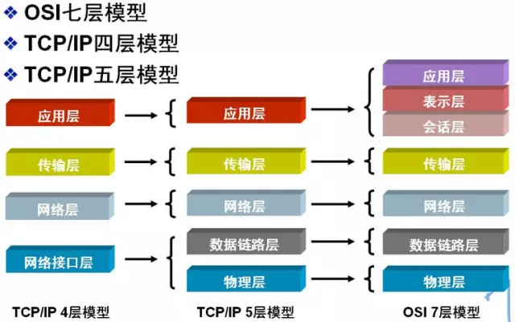

# 计算机网络

## ✏ 网络模型

为了使不同计算机厂家生产的计算机能够相互通信，以便在更大的范围内建立计算机网络，国际标准化组织（ISO）在 1978 年提出了 “开放系统互联参考模型”，即著名的 OSI/RM 模型（Open System Interconnection/Reference Model）。它将计算机网络体系结构的通信协议划分为七层，自下而上依次为：物理层（Physics Layer）、数据链路层（Data Link Layer）、网络层（Network Layer）、传输层（Transport Layer）、会话层（Session Layer）、表示层（Presentation Layer）、应用层（Application Layer）。低三层为通信子网，负责数据传输； 高三层为资源子网，相当于计算机系统，完成数据处理； 传输层承上启下。

除了标准的 OSI 七层模型以外，常见的网络层次划分还有 TCP/IP 四层协议以及 TCP/IP 五层协议，它们之间的对应关系如下图所示：

## ✏ 数据链路层

数据链路层 在物理层所提供的服务的基础上 向网络层提供服务，即将原始的、有差错的物理线路改进成为逻辑上无差错的数据链路，从而向网络层提供高质量的服务。它一般包括 3 种基本服务：无确定的无连接服务、有确定的有连接服务、有确定的无连接服务（不存在无确定的有连接服务）。

### 🖌 1、主要功能

数据链路层的主要功能如下： 

1. 链路管理：负责数据链路的建立、维持和释放，主要用于面向连接服务。 
2. 帧同步：接收方确定收到的比特流中一帧的开始位置和结束位置。 
3. 差错控制：用于使接收方确定收到的数据就是由发送方发送的数据。 
4. 透明传输：不论数据是什么样的比特组合，都应当能够在链路上进行传输。 

### 🖌 2、帧

帧（frame）是数据链路层的传送单位，在 HDLC 协议中，一个帧的格式如下：

| 标志 | 地址 | 控制 | 信息 | 帧校验序列 | 标志 |
| :---: | :---: | :---: | :---: | :---: | :---: |
| F 01111110 | A 8位 | C 8位 | Info N位（可变） | FCS 16位 | F 011111110 |

> 1、问：什么是帧定界？ 
>
> 答：当两个主机之间互相传送消息时，网络层的分组必须将封装成帧，并以帧的格式进行传送。将一段数据的前后分别添加首部和尾部，就够成了帧。首部和尾部中含有很多控制信息，这些信息的重要作用之一就是确定帧的界限，这就是帧定界。 例如，在 HDLC 协议中，帧格式使用标志 F\(01111110\) 来标识帧的开始和结束。
>
> 2、问：为什么组帧时及要求加首部，也要加尾部？而报文切割成分组只加首部？ 
>
> 答：因为在网络中是以帧为最小单位进行传输的，所以接收端要正确地收到帧，必须要清楚该帧再一串比特流中是从哪里开始再哪里结束（因为接收端接收到的时一串比特流，没有首部和尾部不能正确的区分帧）。而分组（也称为 IP数据报）仅仅是包含在帧的数据部分，所以不需要加尾部来定界。

#### 🔨 2.1、透明传输

透明表示一个实际存在的事物看起来好像不存在一样。上表中 **地址到帧校验序列之间为 透明传输区间。**帧使用首部和尾部进行定界，如果帧的数据部分含有和首部尾部相同的内容，那么帧的开始和结束位置就会被错误的判定。需要在数据部分出现首部尾部相同的内容前面插入转义字符。如果数据部分出现转义字符，那么就在转义字符前面再加个转义字符。在接收端进行处理之后可以还原出原始数据。这个过程透明传输的内容是转义字符，用户察觉不到转义字符的存在。如：在 01111110 中拥有 6 个连续的 ‘1’，只要数据帧检测到有 5 个连续的 ‘1’，便马上再其后面插入 ‘0’，而在接收方对该过程实施逆操作，即每次收到 5 个连续的 ‘1’，自动删除后面紧紧跟随的 ‘0’，以恢复数据。这样的方法又称为零比特填充法。

#### 🔨 2.2、组帧

为什么要组帧？直接传送比特流不就可以了？还免去了帧同步、帧定界、透明传输等问题。但是反过来思考，万一传送的比特流出错了怎么办？那就得重新传输全部的比特流，组帧的优点就在于，如果传输出现了错误，只需要重新发送错误的帧即可，这相对于增加帧同步、帧定界、透明传输问题是值得的。组帧不能随意组合，需要让接收方看懂才行，这就需要依据一定的规则将网络层递交下来的分组组装成帧。

四种组帧方法：字符计数法、字节填充的首尾界符法、**比特填充的首尾标志法**、物理编码违例法。

### 🖌 3、差错控制

