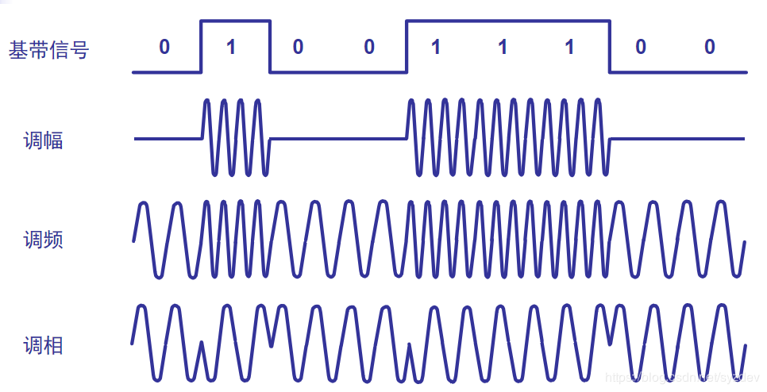
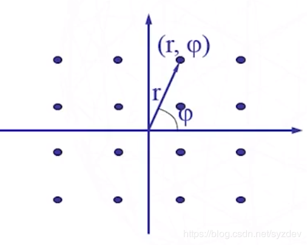
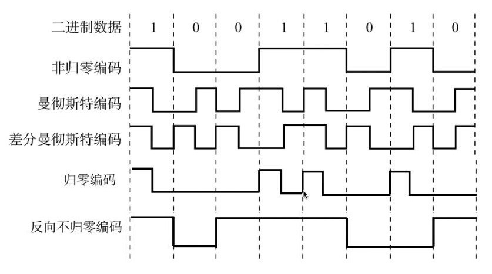
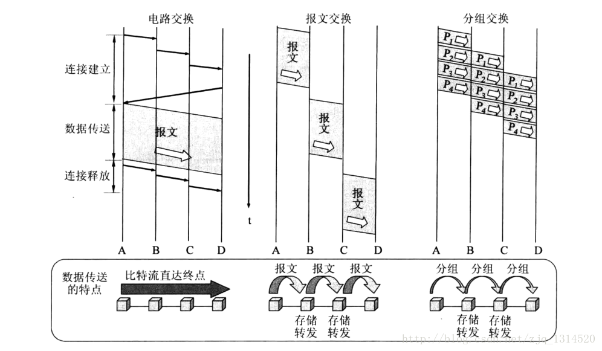

# 物理层

激活、维持、关闭通信端点之间的机械特性、电气特性、功能特性以及过程特性。**该层为上层协议提供了一个传输数据的可靠的物理媒体。简单的说，物理层确保原始的数据可在各种物理媒体上传输。**物理层有两个重要的设备名称，中继器（Repeater，也叫放大器）和集线器。

## ✏ 1、通信基础

### 🔨 1.1、信号

**信号：**信号是数据的电气或电磁的表现，而数据是传送信息（比如图片和文字等）的实体。 

1. 无论是数据或者信号，都既可以是模拟的，也可以是数字的。模拟指的是连续变化的，而数字指的是取值仅允许是有限的离散值。 
2. 信道上传送的信号分别为 **基带信号** 和 **宽带信号**。基带信号指的是将数字信号 0 和 1 直接用两种不同的电压表示，然后传送到数字信道上去传输，称之为基带传输；宽带信号是指将基带信号进行调制后转变成模拟信号，然后再传送到模拟信道上去传输，称之为宽带传输。总之，**基带对应数字信号，宽带对应模拟信号**。在传输距离较近时，计算机网络采用基带传输的方式（近距离衰减少，从而信号内容不易发生变化），在传输距离较远时，计算机网络采用宽带传输的方式（远距离衰减大，即使信号变化大最后也能过滤出基带信号）。
3. 宽带传输类似于频带传输（都是传输模拟信号），只是宽带传输比频带传输具有更多的子信道，并且这些子信道可以同时发送信号。

### 🔨 1.2、信源、信道及信宿

* **信源**：信息的源泉，通信过程中产生和发送信息的设备或计算机。
* **信道**：信息传送的道路，也就是信号的传输媒介，分为有线信道和无线信道，人们常说的双绞线是有线信道的典型代表，人造卫星传播信号是无线信道的典型代表。
* **信宿**：信息的归宿地，也就是通信过程中接受和处理信息的设备或计算机。

### 🔨 1.3、数据传输方式、通信方式与通信模式

**数据传输方式：**分为串行传输和并行传输。串行传输：一个一个比特按照时间顺序传输（远距离传输经常采用）。并行传输：多个比特通过多条信道同时传输（近距离传输经常采用）。 

**通信方式：**分为同步通信和异步通信。同步通信：要求接收端的时钟频率与发送端的时钟频率相等，以便使的接收端对收到的比特流的采样判决时间是准确的。异步通信：发送数据以字节为单位，对每一个字节增加一个起始比特和一个终止比特，共 10bit。接受端收到起始比特，便开始对这个数据单元的 10bit 进行处理，它的特点是发送端发送完一个字节之后，可以经过任意长的时间间隔再发送下一个字节。相对而言，同步通信级数较为复杂，价格昂贵，但是通信效率较高；而异步通信开销较大，价格低廉，使用具有一般精度的时钟来进行数据通信。

**通信模式：**根据信息在传输线上的传送方向，分为以下三种通信模式：

1. 单工通信：单向传输，比如有线广播电视。
2. 半双工通信：双向交替传输，不可以同时发送，也不可以同时接受，比如对讲机。
3. 全双工通信：双向同时传输。

### 🔨 1.4、速率、波特及码元

**速率：**数据的传输速率，即单位时间内传输的数据量。一般速率有两种描述方式：波特率和比特率。 

1. 波特率：又称为码元传输速率，它表示单位时间内数字通信系统所传输的码元个数（也可以成为脉冲个数或者信号变换个数），单位是波特（Baud）。 1 波特表示数字通信系统每秒传输 1 个码元。码元既可以用二进制表示，也可以用多进制表示。 
2. 比特率：又称为信息传输速率，它表示单位时间内数字通信系统所传输的二进制码元的个数，即比特数，单位 bit/s。

> 正常情况下，每比特只能表示两种信号变化，即 0 或者 1 ，可以看成二进制。此时每个码元只能携带 1bit 的信息，因此，在二进制码元的情况下，比特率在数量上和波特率是相等的。 但是，一个码元仅携带一个比特，数据率很低，所有编码专家想办法让一个码元携带更多的比特，来提高传输速率，即通过一些手段将信号的变化次数增加，从而让一个码元携带更多的比特。例如，增加到 16 种信号变化，那么自然需要 4 bit 来表示，此时一个码元携带了 4 bit，传输效率大大增加。如果可以通过某些手段达到无穷种信号变化，数据传输速率就可以无限大。香农发现了速率极限，但至今没有人想出办法达到无穷种信号变化。

### 🔨 1.5、带宽

**带宽**分为模拟信号的带宽和数字信号的带宽。在过去很长一段时间里，通信的主干线路传送的都是模拟信号，此时带宽定义为：通信线路允许通过的信号频带范围，就是允许通过的最高频率减去最低频率，单位是 `Hz`。 但是，在计算机网络中，带宽表示网络的通信线路所能传输数据的能力，因此，带宽表示在单位时间内从网络中某一点到另外一点所通过的“最高数据率”。此时，带宽的单位是 `bit/s` \(比特每秒\)，而不是 `Hz`。

### 🔨 1.6、奈奎斯特定理

**码间串扰：**具体的信道所能通过的频率范围总是有限的（因为具体的信道带宽是有限的），所以信号中的大部分**高频分量**无法通过，这样在传输过程中会发生衰减，导致在接收端收到的信号的波形就失去了码元之间的清晰界限。

**香农采样定理：**又称奈奎斯特采样定理，在通信领域带宽指的是信号最高频率和最低频率的差，单位是 $$Hz$$ 。因此将模拟信号转换成数字信号时，假设原始信号中最大频率为 $$f$$ ，那么采样频率 $$f_{采样}$$ 必须大于或者等于最大频率 $$f$$ 的两倍，才能保证采样后的数字信号完整保留原始模拟信号的信息**。**

**奈奎斯特定理：**寻找保证不出见码间串扰的条件下的码元的输出速率的最大值。奈奎斯特在采样定理和无噪音的基础上，提出了奈奎斯特定理，其公式为：

$$
C_{max}=f_{采样}∗log_2 N=2 f ∗ log_2 N  (bit/s)
$$

上式中， $$f$$ 表示**理想低通信道**的带宽， $$N$$ 表示每个码元的离散电平数目。 由以上公式可知，奈奎斯特定理仅仅是给出了在无噪声情况下的码元的最大传输速率，即 $$2f$$ ，并没有给出最大数据传输率。那是不是可以改变 $$log_2 N$$ ？是的，只要编码足够好，使得一个码元携带无穷个比特，那么最大数据传输速率 $$C_{max}$$ 就可以是无穷大。

> 什么是低通信道？低通信道就是信号的频率只要不超过某个上限值，就可以不失真地通过信道，然而频率超过该上限制则不能通过。也就是说，低通信道没有下限，只有上线。理想低通信道的最高码元传输速率是每秒两个码元。 还有一种叫做理想带通信道，只允许上、下限之间的信号频率成分不失真地通过，其他频率成分不能通过。理想带通信道地最高码元传输速率是每秒一个码元。

### 🔨 1.7、香农定理

**信噪比：**噪音的影响是相对的，也就是说信号越强，噪音的影响就相对较小（二者是同时变化的，仅仅考虑二者之一没有任何意义），所以信噪比指的是信号的平均功率和噪音的平均功率比值（记作 $$S/N$$  ，读作信噪比）。如果用 $$dB$$ （分贝）这个单位，就需要一次换算： $$X\ dB = 10 * log_{10}(S/N)dB$$ 。

引入信噪比之后的可以得到香农公式为：

$$
C_{max}=W∗log_2(1+S/N)  (bit/s)
$$

上式中，W 为信道的带宽，所以想要提高最大数据传输速率，需要尽可能提高传输路线的带宽或者增大所传信号的信噪比。 

* 要使信息的极限传输速率 提高，就必须提高信道的带宽或者信道中的信噪比。换句话说，只要信道的带宽或者信道中的信噪比固定了，那么极限传输速率就固定了。 
* 只要信息的传输速率低于信道的极限传输速率，那么就一定可以找到某种方法实现无差错的传输。 
* 实际信道的传输速率要比极限速率低不少。

香农定理（有噪音的情况）和奈奎斯特定理（无噪音的情况）的前提条件不一样。

> 1、问：奈奎斯特定理公式和香农公式的主要区别是什么？这两个公式对数据通信的意义是什么？ 
>
> 答：奈奎斯特定理公式指出了**码元传输的速率是受限制的**，不能任意提高，否则在接收端就无法正确判断码元是 1 还是 0 \(因为码元之间存在相互干\)。奈奎斯特定理公式是在理想条件下推导出来的。但在实际条件下，最高码元传输速率要比理想条件下得出的数值还要小一些。电信技术人员的任务就是要在实际的条件下，寻找出较好的传输码元波形，将比特转换为较为合适的传输信号。需要注意的是，奈奎斯特定理公式并没有对信息传输速率 \(bit/s\) 给出限制（也就是可以无限大）。要提高信息传输速率就必须使得每一个传输的码元能够代表许多个别特的信息，这就需要很好的编码技术。 
>
> 香农公式给出了**信息传输速率的极限**，即对于一定的传输带宽（以 Hz 为单位）和一定的信噪比，信息传输速率的上线就确定了。这个极限是不能够突破的。要想提高信息的极限传输速率，或者提高传输线路的带宽，或者提高信噪比，没有其余办法。香农公式告诉我们，要想获得无限大的传输带宽，要么使得信号的信噪比无限大，要么是的信道带宽无限大，而这二者都是不可能的。 
>
> 2、问：在有噪声的情况下，“要提高信息的传输速率，或者必须设法提高传输线路的带宽，或者必须设法提高所传信号的信噪比，此外没有其他办法”，为什么我们不可以让每个码元携带更多的比特，这也是可以提高信息传输速率的，为什么说没有其他办法了呢？

> 答：这里所要表达的意思是提高香农公式所确定的极限速率只能提高带宽和信噪比，仅通过改善编码（**改善编码仅仅是在极限传输速率范围内提高传输速率**）是不可能超过香农公式算出的速率的。所以说，要想提高信息的传输极限速率，就一定要提高带宽和信噪比，此外没有其他办法。

## ✏ 2、编码和调制

**数据要放到链路上传播，必须要先转化成信号，由此产生了编码和调制。**

模拟数据和数字数据都可以转换为模拟信号或者数字信号。**调制**：将模拟数据或数字数据（可以通称为数据）转换为模拟信号的过程叫做调制。**编码**：将模拟数据或数字数据转换为数字信号的过程叫做编码。

### 🔨 2.1、调制

#### \*\*\*\*🎇 **2.1.1、数字数据调至为模拟信号**

数字数据调制级数在发送端将数字信号转化成模拟信号，而在接受端将模拟信号还原成数字信号，分别对应调制解调器的调制和解调过程。

调制解调器的调制是为了将数字数据转换成模拟信号，因为数字数据中含有太多的低频成分，而信道不让他过去的原因有两种：都是低频成分，或者低频成分不能与信道的特性相适应。

**解决办法有两种：带通调制、基带调制。** 

1. 带通调制：将基带信号的频率范围搬移到较高的频段以便在信道中传输。 
2. 基带调制：给基带信号的低频成分改变波形，使之适应信道的特性。基带信号的低频成分改变了波形仍然为基带信号，没有变成其他信号。

> 带通调制有四种：
>
> 幅移键控（Amplitude-shift Keying，ASK）：通过改变载波信号的振幅来表示数字信号 1 和 0，而载波的频率和相位都不会改变。比较容易实现，但抗干扰能力差。
>
> 频移键控（Frequency-shift Keying，FSK）：通过改变载波信号的频率来表示数字信号 1 和 0，而载波的振幅和相位都不变。容易实现，抗干扰能力强，目前应用较为广泛。
>
> 相移键控（Phase-shift Keying，PSK）：通过改变载波信号的相位来表示信号 1 和 0，而载波的振幅和频率都不改变。它又分为绝对调相和相对调相。

> 正交振幅调制（Quadrature Amplitude Modulation，QAM）：在频率相同的前提下，将ASK与PSK结合起来，形成叠加信号。设波特率为B，采用 m 个相位，每个相位有 n 种振幅，则该QAM技术的数据传输率: $$R=B log_2(mn)(bit/s)$$ 。如下正交振幅调制 QAM星座图（图中 $$r$$ 代表振幅， $$\varphi$$ 代表相位），可供选择的相位有 12 种，而对于每一种相位有 1 或 2 种振幅可供选择。由于4bit 编码共有 16 种不同的组合，因此这 16个点中的每个点可对应于一种 4bit 的编码。不是码元越多越好。若每一个码元可表示的比特数越多，则在接收端进行解调时要正确识别每一种状态就越困难，出错率增加。

#### \*\*\*\*🎇 **2.1.2、模拟数据调至为模拟信号**

模拟数据调制成模拟信号主要有以下原因：为了实现传输的有效性，可能需要较高的频率；充分利用带宽。

### 🔨 2.2、编码

#### \*\*\*\*🎇 **2.2.1、数字数据编码成数字信号**

数字数据编码用于基带信号传输中，可以在基本不改变数字数据信号频率的请款下，直接传输数字信号。有以下几种方式：

*  **非归零码\(NRZ\)**：用低电平表示 0 ，高电平表示 1，或者反过来。缺点是无法判断一个码元的开始和结束，收发双发很难保持同步。
*  **曼彻斯特编码**将每个码元分成两个相等的间隔。前一个间隔为高电平而后一个间隔为低电平表示码元 1，码元 0 正好相反。其特点是将每一个码元的中间跳变作为收发双方的同步信号，无需额外的同步信号，但是它所占领的频带宽度是原始的基带宽度的二倍。
*  **差分曼彻斯特编码**：如果码元为 1，则其前半个码元的电平与上一个码元的后半个码元的电平一样；如果码元为 0，那么其前半个码元的电平与上一个码元的后半个码元的电平相反。在每一个码元的中间，都有一次电平的跳转。该编码技术比较复杂，但是抗干扰性好。

#### \*\*\*\*🎇 **2.2.2、模拟数据编码成数字信号**

此编码最典型的例子就是**脉冲编码调制（PCM）：**分为三个步骤，采样（参考采样定理）、量化、编码。

## ✏ ****3、传输介质

传输介质分为两大类：**导向性传输介质**（就是用一根实实在在的线来传播，如双绞线、同轴电缆和光纤）和 **非导向性传输介质**（在自由空间中自由传播，如红外线、微波）。

## ✏ 4、物理接口特性

物理层的主要功能其实就是确定与传输介质的接口有关的一些特性。即物理层接口特性。

1. 机械特性：指明接口的形状、尺寸、引线数目和排列等。如果厂家不按照这个规定来制作，就无法与电器连接。
2. 电气特性：电压的范围，即用何种信号来表示电压 0 和电压 1 。
3. 功能特性：接口部件的信号线（数据线、控制线、定时线等）的用途。 
4. 规程特性：或称为过程特性，物理线路上不同功能的各种可能时间出现顺序，即时序关系。

> 问题：物理层是否就是传输介质？如果不是，那么物理层和传输介质之间有什么区别？ 答：首先明确的是，传输介质并不是物理层。传输介质在物理层的下面。由于物理层是体系结构的第 1 层，因此有时候将传输介质称为第 0 层。在传输介质中传输的是信号，但是传输介质并不知道所传输的信号代表的含义。也就是说，传输介质不知道所传输的信号什么时候是 1 ，什么时候是 0。而物理层由于规定了功能特性，因此能够识别所传送的比特流。

## ✏ 5、物理层设备

 物理层设备主要包含**中继器**和 **集线器。**

### \*\*\*\*🔨 **5.1、中继器**

在计算机网络中，最简单的就是两台计算机通过两块网卡构成双机互联，这两台计算机的网卡之间一般是由非屏蔽双绞线来充当信号线的。由于双绞线在传输信号时信号功率会逐渐衰减，当信号衰减到一定程度时会造成信号失真，因此在保证信号质量的前提下，双绞线的最大传输距离是 100m**。**当两台计算机之间的距离超过 100m 时，为了保证实现双机互连，人们便在在这两台计算机之间安装一个中继器，中继器的作用就是将已经衰减的不完整的信号经过整理，重新产生出完整的信号再继续传送。 注意：放大器和中继器都有放大信号的作用，但是 放大器放大的是模拟信号，中继器放大的是数字信号。

### 🔨 5.2、集线器

中继器是普通集线器的前身，集线器实际上就是一种多端口的中继器。集线器一般有 4、8、16、24、32 等数量的 RJ45 接口，通过这些接口，集线器便可以为相应数量的计算机完成“终极功能”。由于它在网络中处于一种“中心”的地位，因此集线器也叫做 Hub。

集线器的工作原理很简单，假设有一个 8 个接口的集线器，一共连接了 8 台计算机。集线器处于网络的“中心”，通过集线器对信号进行转发，可以实现 8 台计算机之间的互相连通。 具体过程如下： 假如计算机 1 要将一条信息发送给计算机 8，当计算机 1 的网卡将信息通过双绞线送到集线器上时，集线器并不会直接将信息发送给计算机 8，它会将信息进行：“广播”，即将信息同时发送给其他 7 个端口。当其他 7 个端口上的计算机收到这条广播信息时，会对信息进行检查，如果发现该信息是发给自己的，则接受，否则便不予理睬。由于该信息是计算机1 发给计算机 8 的，因此最终计算机 8 会接受该信息，而其他 6 台计算机检查信息之后，会因为信息不是发送给自己的而不接受该信息。

> 问：集线器能不能将冲突域隔离开来？ 
>
> 答：首先介绍一下冲突域的概念。在某一个网络中，如果该网络上的两台计算机在通信时会发生冲突，那么这个网络就属于一个冲突域。 当计算机 1 的网卡将信息通过双绞线送到集线器上时，集线器并不能直接将信息传送给计算机 8 ，它会进行“广播”。如果有多台计算机同时通信必然会发生冲突，因此集线器不能隔离冲突域。

集线器在一个时钟周期内只能传输一组信息，如果一台计算机连接的机器数目较多，并且这些机器经常需要同时通信，那么将会导致集线器的工作效率非常差，如发生信息堵塞、碰撞等。 

为什么会发生如此状况？打个比方，一台集线器可以连接 8 台计算机。当计算机 1 正在通过集线器发信息给计算机 8 时，如果计算机 2 想要通过集线器发信息给计算机 7，当它试图与集线器联系时，却发现集线器正在忙计算机 1 的事情，于是计算机 2 便会带着数据栈在集线器面前等待，并实施要求集线器停下计算机1 的工作来帮助自己。如果计算机 2 成功地将集线器“抢”了过来（其实因为集线器是共享的，因此很容易抢到手），此时处于传输状态的计算机 1的数据便会停止，于是计算机1 也会去“抢”集线器。可见，集线器上的每一个端口的真实速度除了与集线器的带宽有关之外，还与同时工作的设备数量有关。例如一个带宽为 100M bit/s 的集线器上连接了 8 台计算机，那么当这 8 台计算机同时工作的时候，每台计算机真正拥有的带宽只是 100M bit/s/8 = 12.5M bit/s。

> 1. 使用中继器和集线器来接的几个网段仍然是一个局域网。
> 2. 使用集线器的以太网在逻辑上依旧是一个总线网，各工作站使用的还是 CSMA/CD协议，并共享逻辑上的总线。

## ✏ 6、数据传输方式

### 🔨 6.1、时延

时延指的是数据从网络的一端传送到另一端所需的时间。网络中的时延有一以下几个不同的部分组成：

1. 发送时延：主机或者路由器发送数据帧说需要的时间，由此发送时延的计算公式为： $$发送时延 = 数据帧长度（b）/发送速率（b/s）$$ 
2. 传播时延：电磁波在信道中传播一定距离需要话费的时间，由此传播时延的计算公式为： $$传播时延 = 信道长度（m）/电磁波在信道上的传播速率（m/s）$$ 
3. 处理时延：主机或者路由器在接受到分组时候要话费一定的时间进行处理，例如分析分组的首部，从分组中提取数据部分，运行差错检验或者查找适当的路由等等。
4. 排队时延：分组在进入路由器后要先在输入队列中等待处理。在路由器确定了转发接口后还需要在输出队列中等待转发，所以就产生了排队时延。

 数据传输方式分为三种：**电路交换、报文交换和分组交换**。

### 🔨 6.2、电路交换

整个报文的比特流连续的从源点直达终点，好像在一个管道中传送。

> 优点：① 通信延迟小。由于通信线路为通信双方用户专用，数据直达，因此传输数据的时延非常小。② 实时性强。通信双方之间的物理通路一旦建立，双方可以随时通信，所以实时性强。③ 有序传输。双方通信时按照发送顺序传送数据，不存在失序问题。④ 适用范围广。电路交换既适用于传输模拟信号，也适用于传输数字信号。⑤ 控制简单。电路交换的交换设备（交换机等）及控制均比较简单。⑥ 避免冲突：不同的通信双方拥有不同的信道，不会出现争用物理信道的问题。 
>
> 缺点：① 建立连接时间长。电路交换建立连接的平均时间相对于计算机通信而言太长。② 信道利用率低。电路交换连接建立之后，物理通路被通信双方独占，即使通信线路空闲也不能被其他用户使用，因此信道利用率低。③ 缺乏统一标准。当电路交换时，数据直达，不同类型、不同规格、不同速率的终端很难相互进行通信，也能难以在通信过程中进行差错控制。④ 灵活性差。只要通信双方建立的通路中的任何一点出现了故障，必须重新拨号建立新的连接。

### 🔨 6.3、报文交换

整个报文先传输到相邻的结点，全部存储下来后查找转发表，转发到下一个结点。

> 优点：① 无需建立连接。报文交换不需要通信双方预先建立一条专用给的通信线路，不存在建立连接时延，用户可以随时发送报文。② 动态分配线路。当发送方把报文交给交换设备时，交换设备先存储整个报文，然后选择一条合适的空闲路线，将报文发送出去。③ 提高可靠性。如果某条传输路径发生故障，可以重新选择另外一条路径传输数据，所以提高了传输的可靠性。④ 提高线路利用率。通信双方不是固定占有一条通信线路，而是在不同的时间一段一段地部分占有这条物理通路，因此大大提高了通信线路的利用率。⑤ 提供多目标服务。一个报文可以同时发送到多个目的地址，这在电路交换中是很难实现的。 
>
> 缺点：① 由于数据进入交换结点后要历经存储、转发这一过程，从而引起转发时延（包括接收报文、检验正确性、排队、发送时间等等）② 报文交换对报文的大小没有限制，这就要求网络结点需要由较大的存储缓存空间。 注意：报文交换主要用于早期的电报通信网络中，现在较少使用，通常被较先进的分组交换方式取代。

### 🔨 6.4、分组交换

单个分组\(报文的一部分\)传送到相邻结点，传送到相邻结点，存储下来后查找转发表，转发到下一个结点。

> 优点：① 加速传输。因为分组是诸葛传输的，所以可以使用后一个分组的存储操作与前一个分组的转发操作并行，这种流水线式传输方式减少了报文的传输时间。此外，传输一个分组所需要的缓冲区也比传输一份报文所需要的缓冲区小很多，这样因为缓冲区不足而等待发送的概率及等待时间也必然少了很多。② 简化了存储管理。因为分组的长度固定，相应的缓冲区的大小也固定，在交换结点中存储器的管理通常被简化为对缓冲区的管理，相对比较容易。③ 减少了出错概率和重发数据量。因为分组较短，其出现错误的概率也会减少，所以每次重发的数据量也就大大减少，这样不仅提高了可靠性，也减少了传输时延。 
>
> 缺点：① 存在传输时延。尽管分组交换比报文交换的传输时延少，但是相对于电路交换仍然存在存储转发时延，而且其结点交换机也必须要有更强的处理能力。② 当分组交换采用数据报服务时，可能出现失序、丢失或者重复分组的现象，分组到达目的结点时，要对分组按照编号进行排序等工作，增加了麻烦。如果采用虚电路服务，虽然无失序问题，但是又呼叫建立、数据传输和虚电路释放 3 个过程。

总之，如果传送的数据量很大，且传送时间远大于呼叫时间，则采用电路交换更合适；当端到端的通路由很多段的链路组成时，采用分组交换传输数据更适合。从提高整个网络的信道利用率上来看，报文交换和分组交换优于电路交换，其中分组交换比报文交换时延小，尤其适合于计算机之间的突发式的数据通信。

> 问：报文和分组有什么区别？
>
> 答：假如某个人要运送 1000kg 的物品（完整的报文，通常将要发送的完整数据成为一个报文），但是每一个箱子只能装 100kg，所以必须把整个物品分成 10 份，然后分别装入 10 个箱子中，而且没一个箱子都要写上寄件人地址（源地址）和收件人地址（目的地址），组成首部，这样 首部 + 物品 就构成了一个分组，等到 10 个分组全部到达目的地，把箱子丢去（去除首部，首部包含源地址和目的地址，当然还有其他，把箱子的壳当作其他东西，箱子上的那张快递单信息当作源地址和目的地址），然后拼装成原来的物品（完整的报文）。
>
> 问：电路交换和面向连接是等同的，而分组交换和无连接是等同的，对吗？ 
>
> 答：不对，电路交换一定是面向连接的，而分组交换则存在面向连接和无连接两种情况。
>
> 电路交换：就是在 A 和 B 要通信的开始，必须建立一条从 A 到 B 的链接（中间可能经过很多交换结点）。当 A 和 B 的连接建立之后，通信就沿着这条路径进行。 A 和 B 在通信期间始终占用这条通道（全程占用），即使在通信的信号在是不在通信路径上流动时（比如打电话时候双方都不说话），也是同样占用信道。通信完毕时释放所占用的信道，即断开连接，将通信资源还给网络，以便让其他用户使用。因此，电路交换是使用面向连接的服务。
>
> 分组交换：也可以使用面向连接的服务，比如，X.25 网络，帧中继网络或者 ATM 网络都属于分组交换网。然而，这种面向连接的分组交换网在传送用户数据之前必须先建立连接，数据传送完毕之后还必须释放连接。因此，使用面向练剑的网络既可以是电路交换，也可以是分组交换。

面向连接和无连接往往是在不同的层次上来讨论的。例如，在数据链路层，HDLC 是面向连接的，而 PPP 和以太网使用的 CSMA/CD 协议是无连接的；在网络层，X.25 协议是面向连接，而 IP 是无连接的；在传输层， TCP 是面向连接的，而 UDP 是无连接的。但是不能说 TCP 是电路交换，而应该说，TCP 可以向应用层提供面向连接的服务。

### 🔨 6.5、电路交换与分组交换的特性比较

| 比较标准 | 电路交换 | 分组交换 |
| :--- | :--- | :--- |
| 建立连接 | 要求 | 不要求 |
| 专用物理路径 | 是 | 否 |
| 每个分组沿着规定的路径 | 是 | 否 |
| 分组按序到达 | 是 | 否 |
| 路由器瘫痪对整体的影响 | 是 | 否 |
| 可用带宽 | 固定 | 动态 |
| 可能拥塞的时间点 | 建立呼叫连接时 | 每个分组传送时 |
| 可能由浪费的带宽 | 是 | 否 |
| 使用储存转发 | 否 | 是 |
| 透明性 | 是 | 否 |
| 收费 | 每分钟 | 每个分组 |

> 对透明性和收费的解释： 
>
> 电路交换中的透明性，信息以数字信号形式在数据通路中“透明”传输，交换机对用户数据信息不存储、分析和处理；分组交换中透明性，每到一个路由器都要对分组首部进行分析，然后传达到下一个路由器。 
>
> 电路交换中收费，例如打电话按分钟计费，而不是说按照说话多少计费；分组交换中收费，例如手机上网按照流量计费，而不是时间计费。

### 🔨 6.6、数据报和虚电路

#### 🎇 6.6.1、数据报：

假设主机 A 给主机 B 发送一个报文，高层协议会将报文拆分成若干带有序号和完整目的地址的分组，交换机根据转发表转发报文。

数据报的原理：

1. 首先主机 A 先将分组逐个地发往与它直接相连的交换机 1 ，交换机 1 将主机 A 发来的分组缓存。
2. 然后查找自己的转发表，不同时刻转发表的内容可能不相同，因此有的分组转发给交换机 2 ，有的分组转发给交换机 3 和交换机 4。
3. 以此类推，直到所有的分组到达主机 B。

数据报的特点：

1. 发送分组前无需建立连接。 
2. 网络尽最大努力交付，传输不保证可靠性，即可能丢失。每个分组都是被独立处理的，所以转发的路径可能不同，因此不一定按序到达对方。 
3. 在有多个分组的报文中，交换机尚未接受完第二个分组，已经收到的第一个分组就可以转发出去，不仅减少延迟，还大大增加了吞吐量。 
4. 当某一台交换机或者链路出现故障时，可以相应地更新转发表，寻找到另外一条代替路径转发分组，对故障适应能力强。 
5. 发送方和接受方不独占某一条链路，所以资源利用率高。

#### 🎇 6.6.2、虚电路：

虚电路方式要求在发送数据前，在源主机和目的主机之间建立一条虚连接。一旦虚连接建立之后，用户发送的数据（以分组为单位）将通过该路径按顺序送达目的主机。当通信完成之后用户发出释放虚电路地请求，由网路清除虚连接。

虚电路方式与电报交换十分类似。其实虚电路是电报交换和分组交换二者结合起来，充分发挥二者的优点。因此，虚电路的通信过程分为三个阶段阶段：虚电路检录，数据传输，虚电路释放阶段。

虚电路的原理：

1. 主机 A 首先发送一个特殊的“呼叫请求”分组，该分组通过中间交换机送往主机 B，如果同意连接，主机 B 就发送“呼叫应答”分组进行确认，虚电路就建立成功。 
2. 虚电路建立之后，主机 A 就可以向主机 B 发送分组了，由于所有分组都是沿着同样的路经，因此分组按序到达主机。 
3. 分组传输结束之后，主机通过发送“释放请求”分组已查出虚电路，整个连接就断开了。 

虚电路的特点：

1. 用户之间必须建立连接，数据传输过程中不需要寻找路径，相对数据报方式时延较小。 
2. 通常分组走同样的路径，所以分组一定是按序到达目的主机的。 
3. 分组首部并不包含目的地址，而是包含虚电路标识符，相对数据报方式开销小。 
4. 当某一个交换机或者链路出现故障而彻底失效时，所有经过该交换机或者该链路的虚电路遭到破坏。

**数据报服务和虚电路服务的特性比较：**

| 比较的标准 | 数据报服务 | 虚电路服务 |
| :--- | :--- | :--- |
| 连接的建立 | 不需要 | 需要 |
| 地址信息 | 每个分组包含完整的源地址和目的地址 | 每个分组包含一个虚电路号 |
| 状态信息 | 路由器不保留有关连接的状态信息 | 每个虚电路都要求路由器为每个连接建立表项 |
| 分组的转发 | 每个分组由独立的路径转发 | 当虚电路建立的时候选择路径，所有分组都沿着这条路径传输 |
| 路由器失效的影响 | 没有影响 | 所有经过此失效的路由器的虚电路都将会终止 |
| 端到端的差错处理 | 由主机负责 | 由通信子网负责 |
| 端到端的流量控制 | 由主机负责 | 由通信子网负责 |
| 分组的顺序 | 到达目的地不一定按序 | 总是按发送顺序到达目的地 |
| 思路 | 可靠通信应当由用户主机保证 | 可靠通信应当由网络保证 |

 注：**数据报服务和虚电路服务都是由网络层提供**。

