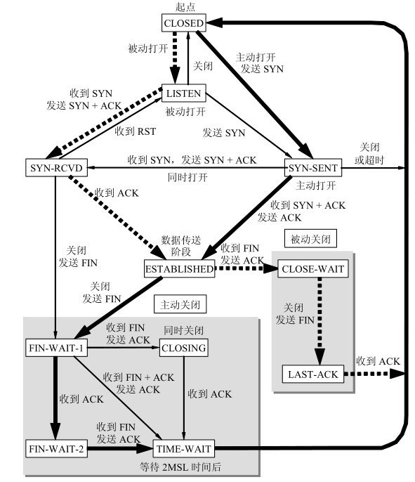
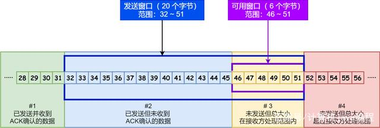
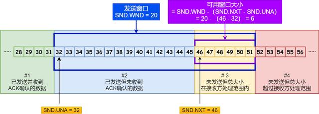
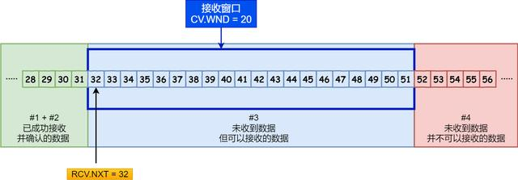
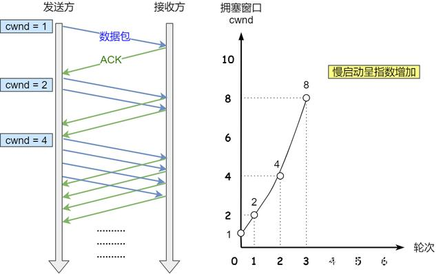
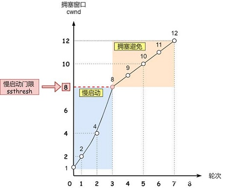
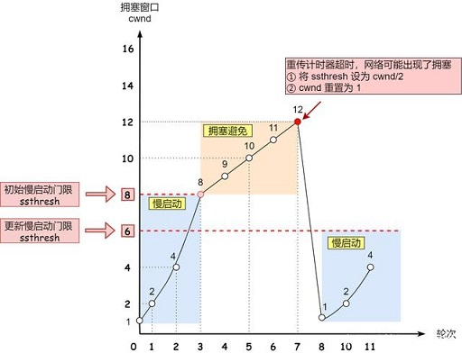
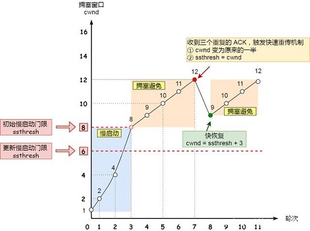

# 传输层之TCP协议

`TCP`\(`Transmission Control Protocol` 传输控制协议\)是一种面向连接\(连接导向\)的、可靠的、 基于`IP`的传输层协议。

## 🖋 1、特点

`TCP`是`TCP/IP`体系中非常复杂的一个协议，`TCP`最主要的特点有：

1. `TCP`是面向连接的运输层协议。应用程序在使用`TCP`协议之前，必须先建立`TCP`连接。在传递数据完毕后，必须释放已建立的`TCP`连接。
2. 每一条`TCP`连接只能有两个端点，即`TCP`是点对点的。
3. `TCP`提供可靠交付的服务，通过`TCP`连接传送的数据，无差错，不丢失，不重复，并且按序到达。
4. `TCP`提供全双工通信。`TCP`允许通信双方的应用进程在任何时候都能发送数据。`TCP`连接的两端都设有发送缓存和接收缓存，用来临时存放双向通信的数据。
5. 面向字节流。`TCP`中的“流”指的是流入到进程或从进程流出的字节序列。“面向字节流”的含义是：虽然应用程序和`TCP`的交互是一次一个数据块\(大小不等\)，但`TCP`把应用程序交下来的数据看成仅仅是一连串的无结构的字节流。`TCP`并不知道所传送的字节流的含义。`TCP`不保证接收方应用程序所收到的数据块和发送方应用程序所发出的数据块具有对应大小的关系。但接收方应用程序收到的字节流必须和发送方应用程序发出的字节流完全一样。当然，接收方的应用程序必须有能力识别收到的字节流，把它还原成有意义的应用层数据。

`TCP`协议重点解决的问题：顺序问题，稳重不乱；丢包问题，承诺靠谱；连接维护，有始有终；流量控制，把握分寸；拥塞控制，知进知退。

## 🖋 2、 **`TCP`包头格式**


`TCP`把连接作为最基本的抽象，每个`TCP`连接有两个端点：

1. 源端口号和目标端口号是不可少的，各占2个字节，这两个值加上IP首部中的源端IP地址和目的端IP地址唯一确定一个`TCP`连接。
2. 包的序号：占4个字节，是本报文段所发送的数据项目组第一个字节的序号。在`TCP`传送的数据流中，每一个字节都有一个序号。例如，一报文段的序号为300，而且数据共100字节，则下一个报文段的序号就是400；序号是`32bit`的无符号数，序号到达 $$2^{32}-1$$ 后从0开始。这个序列号（序列码）可用来补偿传输中的不一致。当`SYN`出现，序列码实际上是初始序列码（`Initial Sequence Number，ISN`），而第一个数据字节是`ISN+1`。
3. 确认序号：占4字节，是期望收到对方下次发送的数据的第一个字节的序号，也就是期望收到的下一个报文段的首部中的序号；确认序号应该是上次已成功收到数据字节序号+1。只有`ACK`标志为1时，确认序号才有效。
4. 数据偏移：占4比特，表示数据开始的地方离`TCP`段的起始处有多远。实际上就是`TCP`段首部的长度。由于首部长度不固定，因此数据偏移字段是必要的。数据偏移以32位为长度单位，也就是4个字节，因此`TCP`首部的最大长度是60个字节。即偏移最大为`15个长度单位=15x32位=15x4字节`。
5. 保留：6比特，供以后应用，现在置为0。
6. 状态位：

   > ① `URG`：当`URG=1`时，注解此报文应尽快传送，而不要按本来的列队次序来传送。与“紧急指针”字段共同应用，紧急指针指出在本报文段中的紧急数据的最后一个字节的序号，使接管方可以知道紧急数据共有多长。
   >
   > ② `ACK`：只有当`ACK=1`时，确认序号字段才有效；
   >
   > ③ `PSH`：当`PSH=1`时，接收方应该尽快将本报文段立即传送给其应用层。在处理`Telnet`或`rlogin`等交互模式的连接时，该标志总是置位的。
   >
   > ④ `RST`：当`RST=1`时，表示出现连接错误，必须释放连接，然后再重建传输连接。复位比特还用来拒绝一个不法的报文段或拒绝打开一个连接；
   >
   > ⑤ `SYN`：`SYN=1`，`ACK=0`时表示请求建立一个连接，携带`SYN`标志的`TCP`报文段为同步报文段；
   >
   > ⑥ `FIN`：发端完成发送任务。

7. 窗口：`TCP`通过滑动窗口的概念来进行流量控制。设想在发送端发送数据的速度很快而接收端接收速度却很慢的情况下，为了保证数据不丢失，显然需要进行流量控制， 协调好通信双方的工作节奏。所谓滑动窗口，可以理解成接收端所能提供的缓冲区大小。`TCP`利用一个滑动的窗口来告诉发送端对它所发送的数据能提供多大的缓冲区。窗口大小为字节数起始于确认序号字段指明的值（这个值是接收端正期望接收的字节）。窗口大小是一个`16bit`字段，因而窗口大小最大为65535字节。
8. 检验和：检验和覆盖了整个`TCP`报文段：`TCP`首部和数据。这是一个强制性的字段，一定是由发端计算和存储，并由收端进行验证。
9. 紧急指针：只有当`URG`标志置1时紧急指针才有效。紧急指针是一个正的偏移量，和序号字段中的值相加表示紧急数据最后一个字节的序号。
10. 选项：长度不定，但长度必须为1个字节。如果没有选项就表示这个1字节的域等于0。为了对齐，填充三个字节，因此`TCP`首部至少24个字节。

## 🖋 3、`TCP`连接和释放

### 🐹 3.1、`TCP`连接三次握手

所谓三次握手（Three-Way Handshake）即建立`TCP`连接，就是指建立一个`TCP`连接时，需要客户端和服务端总共发送3个包以确认连接的建立。在`socket`编程中，这一过程由客户端执行`connect`来触发，整个流程如下图所示：


一开始，客户端和服务端都处于`CLOSED`状态，先是服务端主动监听某个端口，处于`LISTEN`状态。

（1）第一次握手：`Client`将标志位`SYN`置为1，随机产生一个值`seq=J`，并将该数据包发送给`Server`，`Client`进入`SYN_SENT`状态，等待`Server`确认。**`TCP`规定，SYN报文段（SYN=1的报文段）不能携带数据，但需要消耗掉一个序号。**

（2）第二次握手：`Server`收到数据包后由标志位`SYN=1`知道`Client`请求建立连接，`Server`将标志位`SYN`和`ACK`都置为1，`ack=J+1`，随机产生一个值`seq=K`，并将该数据包发送给`Client`以确认连接请求，`Server`进入`SYN_RCVD`状态。**这个报文也不能携带数据，但是同样要消耗一个序号。**

（3）第三次握手：`Client`收到确认后，检查`ack`是否为J+1，`ACK`是否为1，如果正确则将标志位`ACK`置为1，`ack=K+1`，并将该数据包发送给`Server`，`Server`检查`ack`是否为`K+1`，`ACK`是否为1，如果正确则连接建立成功，`Client`和`Server`进入`ESTABLISHED`状态，完成三次握手，随后`Client`与`Server`之间可以开始传输数据了。**`TCP`规定，`ACK`报文段可以携带数据，但是如果不携带数据则不消耗序号。**

> 初始序列号：`tcp`初始序列号是随机的。由于A和B之间的一个`tcp`连接通常是由A和B的2个`ip`地址，2个端口号构成的四元组，因此当A出现了故障把这个`tcp`连接断开了，之后再以相同的四元组建立新的`tcp`连接（也就是说A和B两次建立`tcp`连接都是使用了相同的`ip`地址和端口），就会出现数据乱序的问题。
>
> 用`wireshark`查看数据包，3次握手的数据包的初始序列号seq总是0，其实是`wireshark`进行了处理，为了更友好的显示。在鼠标右键“Protocol Preference”菜单中去掉“`Analyze TCP sequeuece numbers`”，就可以看到真实的序号了。

> **SYN攻击**：
>
> 在三次握手过程中，Server发送`SYN-ACK`之后，收到`Client`的`ACK`之前的`TCP`连接称为半连接（half-open connect），此时Server处于`SYN_RCVD`状态，当收到`ACK`后，Server转入`ESTABLISHED`状态。SYN攻击就是Client在短时间内伪造大量不存在的IP地址，并向Server不断地发送`SYN`包，Server回复确认包，并等待Client的确认，由于源地址是不存在的，因此，Server需要不断重发直至超时，这些伪造的`SYN`包将产时间占用未连接队列，导致正常的SYN请求因为队列满而被丢弃，从而引起网络堵塞甚至系统瘫痪。SYN攻击时一种典型的`DDOS`攻击，检测SYN攻击的方式非常简单，即当Server上有大量半连接状态且源IP地址是随机的，则可以断定遭到SYN攻击了，使用如下命令可以让之现行：

> ```text
> netstat -nap | grep SYN_RECV
> ```

### 🐹 3.2、`TCP`释放连接

所谓四次挥手（`Four-Way Wavehand`）即终止`TCP`连接，就是指断开一个`TCP`连接时，需要客户端和服务端总共发送4个包以确认连接的断开。在`socket`编程中，这一过程由客户端或服务端任一方执行`close`来触发，整个流程如下图所示：


由于`TCP`连接时全双工的，因此，每个方向都必须要单独进行关闭，这一原则是**当一方完成数据发送任务后，发送一个FIN来终止这一方向的连接，收到一个`FIN`只是意味着这一方向上没有数据流动了，即不会再收到数据了，但是在这个`TCP`连接上仍然能够发送数据，直到这一方向也发送了`FIN`。**首先进行关闭的一方将执行主动关闭，而另一方则执行被动关闭，

当前客户端和服务端都处于`ESTAB-LISHED`状态。

（1）第一次挥手：Client发送一个`FIN`，用来关闭`Client`到`Server`的数据传送，Client进入`FIN_WAIT_1`状态。释放数据报文首部，`FIN=1`，其序列号为`seq=u`（等于前面已经传送过来的数据的最后一个字节的序号加1）。**`TCP`规定，FIN报文段即使不携带数据，也要消耗一个序号。**

（2）第二次挥手：Server收到`FIN`后，发送一个`ACK`给Client，`ack=u+1`（与SYN相同，一个`FIN`占用一个序号），并且带上自己的序列号`seq=v`，Server进入`CLOSE_WAIT`状态。**`TCP`服务器通知高层的应用进程，客户端向服务器的方向就释放了，这时候处于半关闭状态，即客户端已经没有数据要发送了，但是服务器若发送数据，客户端依然要接受。**这个状态还要持续一段时间，也就是整个`CLOSE-WAIT`状态持续的时间。客户端收到服务器的确认请求后，此时，客户端就进入`FIN-WAIT-2`（终止等待2）状态，等待服务器发送连接释放报文（在这之前还需要接受服务器发送的最后的数据）。

（3）第三次挥手：服务器将最后的数据发送完毕后，Server发送一个`FIN`，用来关闭Server到Client的数据传送，Server进入`LAST_ACK`状态。释放报文首部，`FIN=1`，`ack=u+1`，由于在半关闭状态，服务器很可能又发送了一些数据，假定此时的序列号为`seq=w`。

（4）第四次挥手：Client收到`FIN`后，Client进入`TIME_WAIT`状态，接着发送一个`ACK`给Server，`ack=w+1`，而自己的序列号是`seq=u+1`，注意此时`TCP`连接还没有释放，必须经过`2∗MSL`（最长报文段寿命）的时间后，当Client撤销相应的`TCB`后，才进入`CLOSED`状态。Server只要收到了Client发出的确认，立即进入`CLOSED`状态。同样，撤销`TCB`后，就结束了这次的`TCP`连接。可以看到，服务器结束`TCP`连接的时间要比客户端早一些。

### 🐹 3.3、问题分析

#### ❓ **3.3.1、为什么`TCP`客户端最后还要发送一次确认呢？即为什么不是两次握手？**

> 一句话，主要防止已经失效的连接请求报文突然又传送到了服务器，从而产生错误。 如果使用的是两次握手建立连接，假设有这样一种场景，客户端发送了第一个请求连接并且没有丢失，只是因为在网络结点中滞留的时间太长了，由于`TCP`的客户端迟迟没有收到确认报文，以为服务器没有收到，此时重新向服务器发送这条报文，此后客户端和服务器经过两次握手完成连接，传输数据，然后关闭连接。此时此前滞留的那一次请求连接，网络通畅了到达了服务器，这个报文本该是失效的，但是，两次握手的机制将会让客户端和服务器再次建立连接，这将导致不必要的错误和资源的浪费。
>
> 如果采用的是三次握手，就算是那一次失效的报文传送过来了，服务端接受到了那条失效报文并且回复了确认报文，但是客户端不会再次发出确认。由于服务器收不到确认，就知道客户端并没有请求连接。

#### ❓ **3.3.2、为什么建立连接是三次握手，而关闭连接却是四次挥手呢？**

> “先关读，再关写”：建立连接的时候， 服务器在`LISTEN`状态下，收到建立连接请求的`SYN`报文后，把`ACK`和`SYN`放在一个报文里发送给客户端。 而关闭连接时，服务器收到对方的FIN报文时，仅仅表示对方不再发送数据了但是还能接收数据，而自己也未必全部数据都发送给对方了，所以己方可以立即关闭， 也可以发送一些数据给对方后，再发送FIN报文给对方来表示同意现在关闭连接，因此，己方`ACK`和`FIN`一般都会分开发送，从而导致多了一次。

#### ❓ **3.3.3、为什么TIME\_WAIT状态需要经过`2MSL`\(最大报文段生存时间\)才能返回到CLOSE状态？**

> **MSL（Maximum Segment Lifetime\)**，`TCP`允许不同的实现可以设置不同的`MSL`值。
>
> 第一，保证客户端发送的最后一个`ACK`报文能够到达服务器，因为这个`ACK`报文可能丢失，站在服务器的角度看来， 我已经发送了`FIN+ACK`报文请求断开了，客户端还没有给我回应，应该是我发送的请求断开报文它没有收到， 于是服务器又会重新发送一次，而客户端就能在这个`2MSL`时间段内收到这个重传的报文，接着给出回应报文，并且会重启`2MSL`计时器。
>
> 第二，防止类似与“三次握手”中提到了的“已经失效的连接请求报文段”出现在本连接中。客户端发送完最后一个确认报文后， 在这个`2MSL`时间中，就可以使本连接持续的时间内所产生的所有报文段都从网络中消失。这样新的连接中不会出现旧连接的请求报文。

## 🖋 4、`TCP`状态机



以字节为单位的滑动窗口：


在`TCP`里，接收端\(B\)会给发送端\(A\)报一个窗口的大小，叫`Advertised window`。

1.在没有收到B的确认情况下，A可以连续把窗口内的数据都发送出去。凡是已经发送过的数据，在

未收到确认之前都必须暂时保留，以便在超时重传时使用。

2.发送窗口里面的序号表示允许发送的序号。显然，窗口越大，发送方就可以在收到对方确认之前连续

发送更多数据，因而可能获得更高的传输效率。但接收方必须来得及处理这些收到的数据。

3.发送窗口后沿的后面部分表示已发送且已收到确认。这些数据显然不需要再保留了。

4.发送窗口前沿的前面部分表示不允许发送的，应为接收方都没有为这部分数据保留临时存放的缓存空间。

5.发送窗口后沿的变化情况有两种：不动（没有收到新的确认）和前移（收到了新的确认）

6.发送窗口前沿的变化情况有两种：不断向前移或可能不动（没收到新的确认）

## 🖋 5、`TCP`可靠性之包应答序列号

面临的问题：网络传输中，会出现数据的破坏，丢包，重复，分片混乱等问题。要想保证传输的可靠性，则需要对传输的内容进行验证。

1. 对于网络数据的破坏，采取的策略是丢弃重新发送，以确保不会出现致命的错误。`TCP`在自身协议中单独划了一块`checksum`用于这种校验，校验算法本质上是将整块数据通过某个函数映射到16位的校验位上（比如用字符相加的和来校验）。

2. 对于数据传输正确，但是分片乱序，重复等问题，或是丢包，采取的策略并非丢弃而是自行进行包重组。

虑两种情况：第一种情况是某个包缺少了，导致整个数据中间缺了一段1000字节，那么如何通知到对方自己少了哪一段数据；另一种情况是由于网络或者重发机制的原因导致某一个包收到多次，如何把多余的包都排除掉，仅保留已有数据。

`TCP`在设计时候充分考虑这点，其中`SYN`和`ACK`就是用来确保这个过程的，`SYN`发送的是字节顺序，`ACK`则应答收到的字节序加1。这样，无论是发送方还是接收方，都可以准确的维护一张发送接收字节的列表。从而可以知道对方还需要哪些字节，或自己已经接收了哪些字节。

## 🖋 6、`TCP`可靠性之重传机制

`TCP`的发送方在规定时间内没有收到确认就要重传已发送的报文段。

### 🐹 6.1、超时重传机制

这种重传的概念很简单，但重传时间的选择却是`TCP`最复杂的问题之一。`TCP`采用了一种自适应算法，它记录一个报文段发出的时间，以及收到相应的确认的时间，这两个时间之差就是报文段的往返时间`RTT`。`TCP`保留了`RTT`的一个加权平均往返时间。超时重传时间`RTO`略大于加权平均往返时间。


`TCP` 会在以下两种情况发生超时重传：数据包丢失或确认应答丢失。超时重传有两种选择：

1. 一种是仅重传`timeout`的包。
2. 另一种是重传`timeout`后所有的数据。

这两种方式各有优缺点，第一种会节省带宽，但是慢，第二种会快一点，但是会浪费带宽，也可能会有无用功。但总体来说效率都不高，因为都在等`timeout`，`timeout`可能会很长。

### 🐹 6.2、快速重传机制

`TCP`引入了一种叫`Fast Retransmit`的算法，不以时间驱动，而以数据驱动重传。也就是说，如果包没有连续到达，就`ack`最后那个可能被丢了的包，如果发送方连续收到3次相同的`ack`，就重传。`Fast Retransmit`的好处是不用等`timeout`了再重传，而只是三次相同的`ack`就重传。

**比如**：如果发送方发出了1，2，3，4，5份数据，第一份先到送了，于是就`ack`回2，结果2因为某些原因没收到，3到达了，于是还是`ack`回2，后面的4和5都到了，但是还是`ack`回2，因为2还是没有收到，于是发送端收到了三个`ack=2`的确认，知道了2还没有到，于是就马上重转2。然后，接收端收到了2，此时因为3，4，5都收到了，于是`ack`回6。

`Fast Retransmit`只解决了一个问题，就是`timeout`的问题，它依然面临一个艰难的选择，就是重转一个还是重传所有的问题。

### 🐹 6.3 **选择确认`SACK`**

如果收到的报文段无差错，只是未按序号，中间还缺少一些序号的数据，那么能否设法只传送缺少的数据而不重传已经正确到达接收方的数据？答案是可以的，选择确认就是一种可行的处理方法。

如果要使用选项确认`SACK`，那么在建立`TCP`连接时，就要在`TCP`首部的选项中加上“允许SACK”的选项，而双方必须都事先商定好。如果使用选择确认，那么原来首部中的“确认号字段”的用法仍然不变。`SACK`文档并没有明确发送方应当怎么响应`SACK`。因此大多数的实现还是重传所有未被确认的数据块。

在 Linux 下，可以通过 `net.ipv4.tcp_sack` 参数打开这个功能（Linux 2.4 后默认打开）。

## 🖋 7、`TCP`可靠性之流量控制

`TCP`流量控制主要是针对接收端的处理速度不如发送端发送速度快的问题，消除发送方使接收方缓存溢出的可能性。`TCP`流量控制主要使用滑动窗口协议，**滑动窗口是接受数据端使用的窗口大小**，用来告诉发送端接收端的缓存大小，以此可以控制发送端发送数据的大小，从而达到流量控制的目的。这个窗口大小就是我们一次传输几个数据。对所有数据帧按顺序赋予编号，发送方在发送过程中始终保持着一个发送窗口，只有落在发送窗口内的帧才允许被发送；同时接收方也维持着一个接收窗口，只有落在接收窗口内的帧才允许接收。这样通过调整发送方窗口和接收方窗口的大小可以实现流量控制。

### 🐹 7.1、滑动窗口

`TCP` 头里有一个字段叫 Window，也就是窗口大小。这个字段是接收端告诉发送端自己还有多少缓冲区可以接收数据。于是发送端就可以根据这个接收端的处理能力来发送数据，而不会导致接收端处理不过来。**所以，通常窗口的大小是由接收方的决定的。**发送方发送的数据大小不能超过接收方的窗口大小，否则接收方就无法正常接收到数据。

#### \*\*\*\*🍈 **7.1.1、发送方的滑动窗口**

发送方的窗口根据处理的情况分成四个部分，其中深蓝色方框是发送窗口，紫色方框是可用窗口：



> **\#1 是已发送并收到 `ACK`确认的数据：1~31 字节**
>
> **\#2 是已发送但未收到 `ACK`确认的数据：32~45 字节**
>
> **\#3 是未发送但总大小在接收方处理范围内（接收方还有空间）：46~51字节**
>
> **\#4 是未发送但总大小超过接收方处理范围（接收方没有空间）：52字节以后**

**可用窗口耗尽**

当发送方把数据「全部」都一下发送出去后，可用窗口的大小就为 0 了，表明可用窗口耗尽，在没收到 `ACK` 确认之前是无法继续发送数据了。


在下图，当收到之前发送的数据 32~36 字节的 `ACK` 确认应答后，如果发送窗口的大小没有变化，则滑动窗口往右边移动 5 个字节，因为有 5 个字节的数据被应答确认，接下来 52~56 字节又变成了可用窗口，那么后续也就可以发送 52~56 这 5 个字节的数据了。


**程序是如何表示发送方的四个部分的呢？**

`TCP` 滑动窗口方案使用三个指针来跟踪在四个传输类别中的每一个类别中的字节。其中两个指针是绝对指针（指特定的序列号），一个是相对指针（需要做偏移）。



* `SND.WND`：表示发送窗口的大小（大小是由接收方指定的）；
* `SND.UNA`：是一个绝对指针，它指向的是已发送但未收到确认的第一个字节的序列号，也就是 \#2 的第一个字节。
* `SND.NXT`：也是一个绝对指针，它指向未发送但可发送范围的第一个字节的序列号，也就是 \#3 的第一个字节。
* 指向 \#4 的第一个字节是个相对指针，它需要 `SND.NXT` 指针加上 `SND.WND` 大小的偏移量，就可以指向 \#4 的第一个字节了。

那么可用窗口大小的计算就可以是：

`可用窗口大 = SND.WND -(SND.NXT - SND.UNA)`

#### \*\*\*\*🍈 **7.1.1、接受方的滑动窗口**

接收方的窗口根据处理的情况划分成三个部分：



> \#1 + \#2 是已成功接收并确认的数据（等待应用进程读取）；
>
> \#3 是未收到数据但可以接收的数据；
>
> \#4 未收到数据并不可以接收的数据；

其中三个接收部分，使用两个指针进行划分:

* `RCV.WND`：表示接收窗口的大小，它会通告给发送方。
* `RCV.NXT`：是一个指针，它指向期望从发送方发送来的下一个数据字节的序列号，也就是 \#3 的第一个字节。
* 指向 \#4 的第一个字节是个相对指针，它需要 `RCV.NXT` 指针加上 `RCV.WND` 大小的偏移量，就可以指向 \#4 的第一个字节了。

**接收窗口和发送窗口的大小是相等的吗？**

并不是完全相等，接收窗口的大小是约等于发送窗口的大小的。因为滑动窗口并不是一成不变的。比如，当接收方的应用进程读取数据的速度非常快的话，这样的话接收窗口可以很快的就空缺出来。那么新的接收窗口大小，是通过 `TCP` 报文中的 Windows 字段来告诉发送方。那么这个传输过程是存在时延的，所以接收窗口和发送窗口是约等于的关系。

### 🐹 7.2、 **滑动窗口的收缩与扩张**

滑动窗口的大小可以依据一定的策略动态调整，应用会根据自身的处理能力的变化通过控制`TCP`接收窗口的大小，来实现流量限制。

## 🖋 8、`TCP`可靠性之拥塞控制

前面的流量控制是避免「发送方」的数据填满「接收方」的缓存，但是并不知道网络的中发生了什么。一般来说，计算机网络都处在一个共享的环境。因此也有可能会因为其他主机之间的通信使得网络拥堵。在网络出现拥堵时，如果继续发送大量数据包，可能会导致数据包时延、丢失等，这时 `TCP` 就会重传数据，但是一重传就会导致网络的负担更重，于是会导致更大的延迟以及更多的丢包，这个情况就会进入恶性循环被不断地放大….所以，`TCP` 不能忽略网络上发生的事，它被设计成一个无私的协议，当网络发送拥塞时，`TCP` 会自我牺牲，降低发送的数据量。于是，就有了拥塞控制，控制的目的就是避免「发送方」的数据填满整个网络。为了在「发送方」调节所要发送数据的量，定义了一个叫做「拥塞窗口」的概念。

### 🐹 8.1、拥塞窗口

拥塞窗口 `cwnd`是发送方维护的一个的状态变量，它会根据网络的拥塞程度动态变化的。我们在前面提到过发送窗口 `swnd` 和接收窗口 `rwnd` 是约等于的关系，那么由于引入了拥塞窗口的概念后，此时发送窗口的值是`swnd = min(cwnd, rwnd)`，也就是拥塞窗口和接收窗口中的最小值。

拥塞窗口 `cwnd` 变化的规则：

* 只要网络中没有出现拥塞，`cwnd` 就会增大；
* 网络中出现了拥塞，`cwnd` 就减少；

那么怎么知道当前网络是否出现了拥塞呢？其实只要「发送方」没有在规定时间内接收到 `ACK` 应答报文，也就是发生了超时重传，就会认为网络出现了拥塞。

拥塞控制主要是四个算法：

1、慢启动；2、拥塞避免；3、拥塞发生4、快速恢复。

### 🐹 8.2、慢启动

`TCP` 在刚建立连接完成后，首先是有个慢启动的过程，这个慢启动的意思就是一点一点的提高发送数据包的数量，如果一上来就发大量的数据，这不是给网络添堵吗？慢启动的算法记住一个规则就行：当发送方每收到一个 `ACK`，就拥塞窗口 `cwnd` 的大小就会加 1。

这里假定拥塞窗口 `cwnd` 和发送窗口 `swnd` 相等，下面举个栗子：

* 连接建立完成后，一开始初始化 `cwnd = 1`，表示可以传一个 `MSS` 大小的数据；
* 当收到一个 `ACK` 确认应答后，`cwnd` 增加 1，于是一次能够发送 2 个；
* 当收到 2 个的 `ACK` 确认应答后， `cwnd` 增加 2，于是就可以比之前多发2 个，所以这一次能够发送 4 个；
* 当这 4 个的 `ACK` 确认到来的时候，每个确认`cwnd` 增加 1， 4 个确认 `cwnd` 增加 4，于是就可以比之前多发 4 个，所以这一次能够发送 8 个。



可以看出慢启动算法，**发包的个数是指数性的增长**。

#### **那慢启动涨到什么时候是个头呢？**

有一个叫慢启动门限 `ssthresh` （`slow start threshold`）状态变量。

* 当 `cwnd < ssthresh` 时，使用慢启动算法。
* 当 `cwnd >= ssthresh` 时，就会使用「拥塞避免算法」。

### 🐹 8.3、拥塞避免

前面说道，当拥塞窗口 `cwnd` 「超过」慢启动门限 `ssthresh` 就会进入拥塞避免算法。一般来说 `ssthresh` 的大小是 65535 字节。

那么进入拥塞避免算法后，它的规则是：每当收到一个 `ACK` 时，`cwnd` 增加 `1/cwnd`。

接上前面的慢启动的栗子，现假定 `ssthresh` 为 8：

当 8 个 `ACK` 应答确认到来时，每个确认增加 1/8，8 个 `ACK` 确认 `cwnd` 一共增加 1，于是这一次能够发送 9 个 `MSS` 大小的数据，变成了线性增长。



所以，我们可以发现，拥塞避免算法就是将原本慢启动算法的指数增长变成了线性增长，还是增长阶段，但是增长速度缓慢了一些。就这么一直增长着后，网络就会慢慢进入了拥塞的状况了，于是就会出现丢包现象，这时就需要对丢失的数据包进行重传。当触发了重传机制，也就进入了「拥塞发生算法」。

### 🐹 8.4、拥塞发生

当网络出现拥塞，也就是会发生数据包重传，重传机制主要有两种：超时重传和快速重传。这两种使用的拥塞发送算法是不同的。

#### 🍈 8.4.1、发生超时重传的拥塞发生算法

当发生了「超时重传」，则就会使用拥塞发生算法。这个时候，`sshresh` 和 `cwnd` 的值会发生变化：

* `ssthresh` 设为 `cwnd/2`，`cwnd` 重置为 1



接着，就重新开始慢启动，慢启动是会突然减少数据流的。这真是一旦「超时重传」，马上回到解放前。但是这种方式太激进了，反应也很强烈，会造成网络卡顿。

#### 🍈 8.4.2、发生快速重传的拥塞发生算法

还有更好的方式，前面我们讲过「快速重传算法」。当接收方发现丢了一个中间包的时候，发送三次前一个包的 `ACK`，于是发送端就会快速地重传，不必等待超时再重传。

`TCP` 认为这种情况不严重，因为大部分没丢，只丢了一小部分，则 `ssthresh` 和 `cwnd` 变化如下：

* `cwnd = cwnd/2` ，也就是设置为原来的一半；
* `ssthresh = cwnd`；
* 进入快速恢复算法。

### 🐹 8.5、快速恢复

快速重传和快速恢复算法一般同时使用，快速恢复算法是认为，你还能收到 3 个重复 `ACK` 说明网络也不那么糟糕，所以没有必要像 `RTO` 超时那么强烈。

正如前面所说，进入快速恢复之前，`cwnd` 和 `ssthresh`已被更新了：

* `cwnd = cwnd/2` ，也就是设置为原来的一半；
* `ssthresh = cwnd`；
* 然后，进入快速恢复算法如下：
  * 拥塞窗口 `cwnd = ssthresh + 3` （ 3 的意思是确认有 3 个数据包被收到了）
  * 重传丢失的数据包
  * 如果再收到重复的 `ACK`，那么 `cwnd` 增加 1
  * 如果收到新数据的 `ACK` 后，设置 `cwnd` 为 `ssthresh`，接着就进入了拥塞避免算法



快速重传和快速恢复，也就是没有像「超时重传」一夜回到解放前，而是还在比较高的值，后续呈线性增长。

## 🖋 9、`TCP`中的计时器

`TCP`中有四种计时器（Timer），分别为：

1. 重传计时器：`Retransmission Timer`
2. 坚持计时器：`Persistent Timer`
3. 保活计时器：`Keeplive Timer`
4. 时间等待计时器：`Timer_Wait Timer`

### 🐹 9.1、重传计时器

大家都知道`TCP`是保证数据可靠传输的。怎么保证呢？带确认的重传机制。在滑动窗口协议中，接受窗口会在连续收到的包序列中的最后一个包向接收端发送一个`ACK`，当网络拥堵的时候，发送端的数据包和接收端的`ACK`包都有可能丢失。`TCP`为了保证数据可靠传输，就规定在重传的“时间片”到了以后，如果还没有收到对方的`ACK`，就重发此包，以避免陷入无限等待中。

当`TCP`发送报文段时，就创建该特定报文的重传计时器。可能发生两种情况：

1. 若在计时器截止时间到之前收到了对此特定报文段的确认，则撤销此计时器。
2. 若在收到了对此特定报文段的确认之前计时器截止时间到，则重传此报文段，并将计时器复位。

### 🐹 9.2、持久计时器

先来考虑一下情景：发送端向接收端发送数据包知道接受窗口填满了，然后接受窗口告诉发送方接受窗口填满了停止发送数据。此时的状态称为“零窗口”状态，发送端和接收端窗口大小均为0。直到接受`TCP`发送确认并宣布一个非零的窗口大小。但这个确认会丢失。我们知道`TCP`中，对确认是不需要发送确认的。若确认丢失了，接受`TCP`并不知道，而是会认为他已经完成了任务，并等待着发送`TCP`接着会发送更多的报文段。但发送`TCP`由于没有收到确认，就等待对方发送确认来通知窗口大小。双方的`TCP`都在永远的等待着对方。

要打开这种死锁，`TCP`为每一个链接使用一个持久计时器。当发送`TCP`收到窗口大小为0的确认时，就坚持启动计时器。当坚持计时器期限到时，发送`TCP`就发送一个特殊的报文段，叫做探测报文。这个报文段只有一个字节的数据。他有一个序号，但他的序号永远不需要确认；甚至在计算机对其他部分的数据的确认时该序号也被忽略。探测报文段提醒接受`TCP`：确认已丢失，必须重传。

坚持计时器的值设置为重传时间的数值。但是，若没有收到从接收端来的响应，则需发送另一个探测报文段，并将坚持计时器的值加倍和复位。发送端继续发送探测报文段，将坚持计时器设定的值加倍和复位，直到这个值增大到门限值（通常是60秒）为止。在这以后，发送端每个60秒就发送一个探测报文，直到窗口重新打开。

### 🐹 9.3、保活计时器

保活计时器使用在某些实现中，用来防止在两个`TCP`之间的连接出现长时间的空闲。假定客户打开了到服务器的连接，传送了一些数据，然后就保持静默了。也许这个客户出故障了。在这种情况下，这个连接将永远的处理打开状态。

要解决这种问题，在大多数的实现中都是使服务器设置保活计时器。每当服务器收到客户的信息，就将计时器复位。通常设置为两小时。若服务器过了两小时还没有收到客户的信息，他就发送探测报文段。若发送了10个探测报文段（每一个像个75秒）还没有响应，就假定客户除了故障，因而就终止了该连接。

这种连接的断开当然不会使用四次握手，而是直接硬性的中断和客户端的`TCP`连接。

### 🐹 9.4、时间等待计时器

时间等待计时器是在四次握手的时候使用的。四次握手的简单过程是这样的：假设客户端准备中断连接，首先向服务器端发送一个FIN的请求关闭包（`FIN=final`），然后由established过渡到`FIN-WAIT1`状态。服务器收到FIN包以后会发送一个`ACK`，然后自己有`established`进入`CLOSE-WAIT`。此时通信进入半双工状态，即留给服务器一个机会将剩余数据传递给客户端，传递完后服务器发送一个`FIN+ACK`的包，表示我已经发送完数据可以断开连接了，就这便进入`LAST_ACK`阶段。客户端收到以后，发送一个`ACK`表示收到并同意请求，接着由`FIN-WAIT2`进入`TIME-WAIT`阶段。服务器收到`ACK`，结束连接。此时（即客户端发送完`ACK`包之后），客户端还要等待`2MSL`（`MSL=maxinum segment lifetime`最长报文生存时间，`2MSL`就是两倍的`MSL`）才能真正的关闭连接。

## ✏ 10、`TCP`的公平性

公平性是在发生拥塞时各源端（或同一源端建立的不同`TCP`连接或`UDP`数据报）能公平地共享同一网络资源（如带宽、缓存等）。处于相同级别的源端应该得到相同数量的网络资源。产生公平性的根本原因在于拥塞发生必然导致数据包丢失，而数据包丢失会导致各数据流之间为争抢有限的网络资源发生竞争，争抢能力弱的数据流将受到更多损害。因此，没有拥塞，也就没有公平性问题。

`TCP`层上的公平性问题表现在两方面：

\(1\) 面向连接的`TCP`和无连接的`UDP`在拥塞发生时对拥塞指示的不同反应和处理，导致对网络资源的不公平使用问题。在拥塞发生时，有拥塞控制反应机制的`TCP`数据流会按拥塞控制步骤进入拥塞避免阶段，从而主动减小发送入网络的数据量。但对无连接的数据报`UDP`，由于没有端到端的拥塞控制机制，即使网络发出了拥塞指示（如数据包丢失、收到重复`ACK`等），`UDP`也不会像`TCP`那样减少向网络发送的数据量。结果遵守拥塞控制的`TCP`数据流得到的网络资源越来越少，没有拥塞控制的`UDP`则会得到越来越多的网络资源，这就导致了网络资源在各源端分配的严重不公平。

网络资源分配的不公平反过来会加重拥塞，甚至可能导致拥塞崩溃。因此如何判断在拥塞发生时各个数据流是否严格遵守`TCP`拥塞控制，以及如何“惩罚”不遵守拥塞控制协议的行为，成了目前研究拥塞控制的一个热点。在传输层解决拥塞控制的公平性问题的根本方法是全面使用端到端的拥塞控制机制。  


\(2\) 一些`TCP`连接之间也存在公平性问题。产生问题的原因在于一些`TCP`在拥塞前使用了大窗口尺寸，或者它们的`RTT`较小，或者数据包比其他`TCP`大，这样它们也会多占带宽。

### 🖋 10.1、`RTT`不公平性

`AIMD`拥塞窗口更新策略也存在一些缺陷，和式增加策略使发送方发送数据流的拥塞窗口在一个往返时延\(`RTT`\)内增加了一个数据包的大小，因此，当不同的数据流对网络瓶颈带宽进行竞争时，具有较小`RTT`的`TCP`数据流的拥塞窗口增加速率将会快于具有大`RTT`的`TCP`数据流，从而将会占有更多的网络带宽资源。

丢包使得`TCP`传输速度大幅下降的主要原因是丢包重传机制，控制这一机制的就是`TCP`拥塞控制算法。 Linux内核中提供了若干套`TCP`拥塞控制算法，已加载进内核的可以通过内核参数`net.ipv4.tcp_available_congestion_control`看到。

### 🖋 10.2、Reno

Reno是目前应用最广泛且较为成熟的算法。该算法所包含的慢启动、拥塞避免和快速重传、快速恢复机制，是现有的众多算法的基础。从Reno运行机制中很容易看出，为了维持一个动态平衡，必须周期性地产生一定量的丢失，再加上`AIMD`机制--减少快，增长慢，尤其是在大窗口环境下，由于一个数据报的丢失所带来的窗口缩小要花费很长的时间来恢复，这样，带宽利用率不可能很高且随着网络的链路带宽不断提升，这种弊端将越来越明显。公平性方面，根据统计数据，Reno的公平性还是得到了相当的肯定，它能够在较大的网络范围内理想地维持公平性原则。

Reno算法以其简单、有效和鲁棒性成为主流，被广泛的采用。但是它不能有效的处理多个分组从同一个数据窗口丢失的情况。这一问题在New Reno算法中得到解决。

### 🖋 10.3、基于丢包反馈的协议

近几年来，随着高带宽延时网络（High Bandwidth-Delay product network）的普及，针对提高`TCP`带宽利用率这一点上，又涌现出许多新的基于丢包反馈的`TCP`协议改进，这其中包括`HSTCP`、`westwood`、`STCP`、`BIC-TCP`、`CUBIC`和`H-TCP`。

总的来说，基于丢包反馈的协议是一种被动式的拥塞控制机制，其依据网络中的丢包事件来做网络拥塞判断。即便网络中的负载很高时，只要没有产生拥塞丢包，协议就不会主动降低自己的发送速度。这种协议可以最大程度的利用网络剩余带宽，提高吞吐量。然而，由于基于丢包反馈协议在网络近饱和状态下所表现出来的侵略性，一方面大大提高了网络的带宽利用率；但另一方面，对于基于丢包反馈的拥塞控制协议来说，大大提高网络利用率同时意味着下一次拥塞丢包事件为期不远了，所以这些协议在提高网络带宽利用率的同时也间接加大了网络的丢包率，造成整个网络的抖动性加剧。


