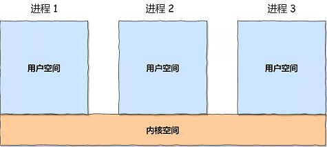

# Linux进程间通信


每个进程的用户地址空间都是独立的，一般而言是不能互相访问的，但内核空间是每个进程都共享的，所以进程之间要通信必须通过内核。



## ✏ 1、管道

Linux 管道使用竖线`|`连接多个命令，这被称为管道符。如：

```bash
$ ps auxf | grep mysql 
```

它的功能是将前一个命令（`ps auxf`）的输出，作为后一个命令（`grep mysql`）的输入，从这功能描述，可以看出**管道传输数据是单向的。**并且上面这种管道是没有名字的，所以`|`表示的管道称为匿名管道，用完了就销毁。

管道还有另外一个类型是命名管道，也被叫做 FIFO，因为数据是先进先出的传输方式。在使用命名管道前，先需要通过 `mkfifo` 命令来创建，并且指定管道名字：

```bash
$ mkfifo myPipe
```

myPipe 就是这个管道的名称，基于 Linux 一切皆文件的理念，所以管道也是以文件的方式存在，我们可以用 ls 看一下，这个文件的类型是 p，也就是 pipe（管道） 的意思：

```bash
$ ls -l
prw-r--r--. 1 root    root         0 Jul 17 02:45 myPipe
```

接下来，我们往 myPipe 这个管道写入数据：

```bash
$ echo "hello" > myPipe // 将数据写进管道 
                        // 停住了 ... 
```

操作完成后，你会发现命令执行后就停在这了，这是因为管道里的内容没有被读取，只有当管道里的数据被读完后，命令才可以正常退出。于是，我们执行另外一个命令来读取这个管道里的数据：

```bash
$ cat < myPipe // 读取管道里的数据 
hello
```

可以看到，管道里的内容被读取出来了，并打印在了终端上，另外一方面，echo 那个命令也正常退出了。可以看出，**管道这种通信方式效率低，不适合进程间频繁地交换数据**。

### 🖊 1.1、无名管道的原理

匿名管道的创建，需要通过下面这个系统调用：

```c
int pipe(int fd[2])
```

这里表示创建一个匿名管道，并返回了两个描述符，一个是管道的读取端描述符 `fd[0]`，另一个是管道的写入端描述符 `fd[1]`。注意，这个匿名管道是特殊的文件，只存在于内存，不存于文件系统中。

其实，所谓的管道，就是内核里面的一串缓存。从管道的一段写入的数据，实际上是缓存在内核中的，另一端读取，也就是从内核中读取这段数据。另外，管道传输的数据是无格式的流且大小受限。

在 shell 里面执行 `A | B`命令的时候，A 进程和 B 进程都是 shell 使用 fork 创建的子进程，两个进程各有 `fd[0]` 与 `fd[1]` ，A 和 B 之间不存在父子关系，它俩的父进程都是 shell。

所以说，在 shell 里通过「`|`」匿名管道将多个命令连接在一起，实际上也就是创建了多个子进程，那么在我们编写 shell 脚本时，能使用一个管道搞定的事情，就不要多用一个管道，这样可以减少创建子进程的系统开销。

我们可以得知，**对于匿名管道，它的通信范围是存在父子关系的进程**。因为管道没有实体，也就是没有管道文件，只能通过 fork 来复制父进程 fd 文件描述符，来达到通信的目的。

另外，**对于命名管道，它可以在不相关的进程间也能相互通信**。因为命令管道，提前创建了一个类型为管道的设备文件，在进程里只要使用这个设备文件，就可以相互通信。

不管是匿名管道还是命名管道，进程写入的数据都是缓存在内核中，另一个进程读取数据时候自然也是从内核中获取，同时通信数据都遵循**先进先出**原则，不支持 lseek 之类的文件定位操作。

### 🖊 1.2、有名管道的原理

