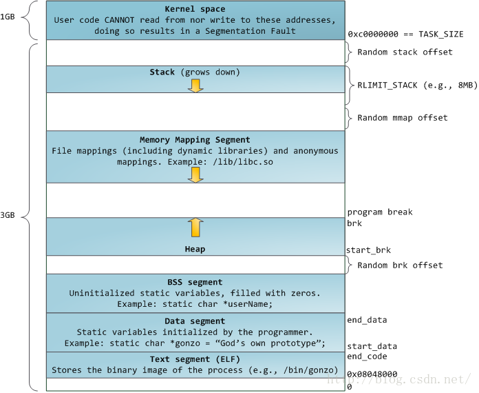

# Linux进程的内存空间布局

下图是一张32位`x86`架构上运行的Linux中进程标准的内存段布局， 通过该图从上至下的简要分析Linux中进程的内存分布情况和各自的大致用途：

对于32位`X86`架构上运行的Linux而言， 其虚拟地址空间的寻址范围从`0 ~ 4G`，内核将这块空间划分为两个部分，将最高的`1G`字节`0xC0000000 ~ 0xFFFFFFFF`称为“内核空间”， 顾名思义是提供给内核使用；而将较低`3G`字节`0x00000000 ~ 0xBFFFFFFF`称为“用户空间”，即提供给各个运行的进程使用。 

## 🖋 1、内核空间

在多任务操作系统中的每个进程都运行在一个属于自己的内存沙盒里， 这个沙盒即虚拟地址空间（virtual address space），在32位模式下它总是一个`4GB`的内存地址块。这些虚拟地址再通过页表\(page table\)来映射到物理内存上， 页表由操作系统维护并被CPU所引用。每一个进程拥有一套属于它自己的页表，所以用户空间地址的映射是动态变化的。理论上，每个进程都是可以访问全部能寻址的`4G`虚拟内存空间的，但是有一个隐情，即只要虚拟地址被使能，那么它就会作用于这台机器上运行的所有软件，包括内核本身。因此一部分虚拟地址必须保留给内核使用，系统为了防止内核空间被用户进程有意或无意的破坏，所以采用了分级保护措施： 将内核定为0级，将用户进程定为3级， 这样用户进程便无法直接访问内核的虚拟内存空间，仅能通过系统调用来进入内核态，从而来访问被限定的部分内核空间地址。同时，由于访问权限的机制，不同的进程间也都拥有独立的用户空间。这样非对称的访问机制使得Linux系统运行更加的安全稳定。

这并不意味着内核使用了那么多的物理内存，仅表示它可支配这么大的地址空间，可根据内核需要，将其映射到物理内存。内核空间在页表中拥有较高的特权级（ring 2或以下），因此只要用户态的程序试图访问这些页，就会导致一个页错误（page fault）。在Linux中，内核空间是持续存在的，并且在所有进程中都映射到同样的物理内存，这样便于寻址以应对随时出现的中断和系统调用。与此相反，用户地址空间的映射随进程切换的发生而不断变化。

另外，用户进程也是无法访问`0x00000000 ~ 0x08048000`这一段虚拟内存地址的，在这段地址上有诸多例如C库，动态加载器如`ld.so`和`VDSO`等的映射地址。 如果用户进程访问到该区间会返回段错误。 

## 🖋 2、用户空间

### 🐹 2.1、栈

用户空间中最顶部的段叫做栈，他被用于存放函数参数和动态局部变量。调用一个方法或函数会将一个新的栈帧（stack frame）压入到栈中，这个栈帧会在函数返回时被清理掉。在运行过程中，进程通过函数的调用和返回使得控制权在各个函数间转移，在新函数调用时，原函数的栈帧状态保持不变，并为新的函数开辟其所需的帧空间；当调用函数返回时，该函数的运行空间随着栈帧被弹出而清空，这次进程回到原函数的栈帧环境中继续执行。**进程中的每一个线程都有属于自己的栈**。

> 通过不断向栈中压入数据，超出其容量就会耗尽栈所对应的内存区域，这将触发一个页故障（page fault），而被Linux的`expand_stack()`处理，它会调用`acct_stack_growth()`来检查是否还有合适的地方用于栈的增长。如果栈的大小低于`RLIMIT_STACK`（通常为8MB），那么一般情况下栈会被加长，程序继续执行，感觉不到发生了什么事情。这是一种将栈扩展到所需大小的常规机制。然而，如果达到了最大栈空间的大小，就会栈溢出\(stack overflow\)，程序收到一个段错误\(segmentation fault\)。
>
> 注: 动态栈增长是唯一一种访问未映射内存区域而被允许的情形，其他任何对未映射内存区域的访问都会触发页错误，从而导致段错误。一些被映射的区域是只读的，因此企图写这些区域也会导致段错误。

`X86`系统进程中栈都向下增长的，那为什么是向下增长呢？

**这样设计可以使得堆和栈能够充分利用空闲的地址空间。**每一个可执行C程序，从低地址到高地址依次是：text，data，bss，堆，栈，环境参数变量；其中堆和栈之间有很大的地址空间空闲着，在需要分配空间的时候，堆向上涨，栈往下涨。如果栈向上涨的话，我们就必须得指定栈和堆的一个严格分界线，但这个分界线怎么确定呢？平均分？但是有的程序使用的堆空间比较多，而有的程序使用的栈空间比较多。所以就可能出现这种情况：一个程序因为栈溢出而崩溃的时候，其实它还有大量闲置的堆空间呢，但是我们却无法使用这些闲置的堆空间。所以呢，最好的办法就是让堆和栈一个向上涨，一个向下涨，这样它们就可以最大程度地共用这块剩余的地址空间，达到利用率的最大化！

### 🐹 2.2、`mmap`

在栈段的低一段便是`mmap`（内存映射）段，`mmap`是一种高效便捷的文件I/O方式，内核将文件内容映射在此段内存中，常见情形便是加载动态链接库。 任何应用程序都可以通过 Linux 的 `mmap()` 系统调用或 Windows 的 `CreateFileMapping()/MapViewOfFile()`请求这种映射。另外，在Linux中，如果你通过`malloc`申请一块大于`MMAP_THRESHOLD`\(通常默认为`128KB`， 可用`mallopt()`修改\)大小的堆空间时， `glibc`会返回一块匿名的`mmap`内存块而非一块堆内存。 

### 🐹 2.3、堆

在`mmap`段下面便是堆段了，堆段同栈段一样，都是为进程运行提供动态的内存分配，但是其和栈的区别在于堆上内存的生命期和执行分配的函数的生命期不一致，堆上分配的内存只有在对应进程通过系统调用主动释放或进程结束后才会释放。 如果堆中有足够的空间来满足内存请求，它就可以被语言运行时库处理而不需要内核参与。否则，堆会被扩大，通过`brk()`系统调用来分配请求所需的内存块。 堆管理是很复杂的，需要精细的算法，应付我们程序中杂乱的分配模式，优化速度和内存使用效率。所以，内存泄露这个经典的问题便由此产生。 另外， 由于堆内存的反复申请和释放，也不可避免的会造成堆段碎片化。这种情况可以使用“对象池”的设计手段来避免。

> 当计算机正常运转时，几乎每一个进程的各个段的起始虚拟地址都与上图完全一致，这也给远程发掘程序安全漏洞打开了方便之门。一个发掘过程往往需要引用绝对内存地址：栈地址，库函数地址等。远程攻击者必须依赖地址空间布局的一致性，摸索着选择这些地址。如果让他们猜个正着，有人就会被整了。因此，地址空间的随机排布方式逐渐流行起来。Linux 通过对栈内存映射段、堆的起始地址加上随机的偏移量来打乱布局。不幸的是，32 位地址空间相当紧凑，给随机化所留下的空当不大，削弱了这种技巧的效果。

### 🐹 2.4、`BSS`、`DATA`

堆段再往下便是`BSS`段和`DATA`段这两个静态内存区域，这两段都是用来存储静态局部或静态全局变量，其在编译期间便决定了虚拟内存的消耗。区别是DATA段存放的是已经初始化的变量，其映射自程序镜像中包含对应静态变量的文件；而`BSS`段则存放的是未初始化的变量，他不映射自任何一个执行文件。根据C语言标准规定，未初始化的静态成员变量的初始值必须为0，所以内核在加载二进制文件后执行程序前会将`BSS`段清0。`BSS`内存区域是匿名的：它不映射到任何文件。如：`static int cntActiveUsers`，则`cntActiveUsers`的内容就会保存在`BSS`中。

数据段保存在源代码中已经初始化了的静态变量内容，这个内存区域不是匿名的。它映射了一部分的程序二进制镜像，也就是源代码中指定了初始值的静态变量。所以，如果写`static int cntWorkerBees = 10`，则`cntWorkerBees`的内容就保存在数据段中了，而且初始值为10。尽管数据段映射了一个文件，但它是一个私有内存映射，这意味着更改此处的内存不会影响到被映射的文件。也必须如此，否则给全局变量赋值将会改动你硬盘上的二进制镜像，这是不可想象的。

下图中数据段的例子更加复杂，因为它用了一个指针。在此情况下，指针gonzo（4字节内存地址）本身的值保存在数据段中。而它所指向的实际字符串则不在这里。这个字符串保存在代码段中，代码段是只读的，保存了你全部的代码外加零零碎碎的东西，比如字符串字面值。代码段将你的二进制文件也映射到了内存中，但对此区域的写操作都会使你的程序收到段错误。这有助于防范指针错误，虽然不像在C语言编程时就注意防范来得那么有效。下图展示了这些段以及我们例子中的变量：

可以通过阅读文件`/proc/pid_of_process/maps`来检验一个Linux进程中的内存区域。记住一个段可能包含许多区域。比如，每个内存映射文件在`mmap`段中都有属于自己的区域，动态库拥有类似`BSS`和数据段的额外区域。

`BSS`和`DATA`段下是代码段\(TEXT\)，这段中存有程序的指令代码。**Text段是通过只读的方式加载到内存中的，它在多个进程中是可以被安全共享的。** 

