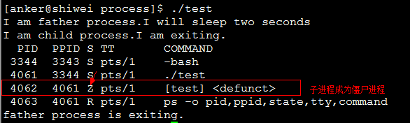
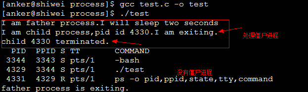

# Linux进程

## ✏ 1、孤儿进程和僵尸进程

### 🖋 1.1、孤儿进程

孤儿进程，顾名思义，和现实生活中的孤儿有点类似，当一个进程的父进程结束时，但是它自己还没有结束，那么这个进程将会成为孤儿进程。最后孤儿进程将会被`init`进程（进程号为1）的进程收养，当然在子进程结束时也会由`init`进程完成对它的状态收集工作，因此一般来说，孤儿进程并不会有什么危害。

```c
#include <stdio.h>
#include <stdlib.h>
#include <errno.h>
#include <unistd.h>

int main(){
    pid_t pid;
    pid = fork(); //创建一个进程
    if (pid < 0){ //创建失败
        perror("fork error:");
        exit(1);
    }
    //子进程
    if (pid == 0){
        printf("I am the child process.\n");
        //输出进程ID和父进程ID
        printf("pid: %d\tppid:%d\n",getpid(),getppid());
        printf("I will sleep five seconds.\n");
        sleep(5); //睡眠5s，保证父进程先退出
        printf("pid: %d\tppid:%d\n",getpid(),getppid());
        printf("child process is exited.\n");
    }else{  //父进程
        printf("I am father process.\n");
        sleep(1); //父进程睡眠1s，保证子进程输出进程id
        printf("father process is  exited.\n");
    }
    return 0;
}
```


### 🖋 1.2、僵尸进程

僵尸进程是指：一个进程使用`fork`创建子进程，如果子进程退出，而父进程并没有调用`wait`或`waitpid`获取子进程的状态信息，那么子进程的某些信息如进程描述符仍然保存在系统中。这种进程称之为僵尸进程。

任何一个子进程\(`init`除外\)在`exit()`之后，并非马上就消失掉，而是留下一个称为僵尸进程\(Zombie\)的数据结构，等待父进程处理**。**这是每个子进程在结束时都要经过的阶段。如果子进程在`exit()`之后，父进程没有来得及处理，这时用`ps`命令就能看到子进程的状态是`“Z”`。如果父进程能及时 处理，可能用`ps`命令就来不及看到子进程的僵尸状态，但这并不等于子进程不经过僵尸状态。 如果父进程在子进程结束之前退出，则子进程将由`init`接管。`init`将会以父进程的身份对僵尸状态的子进程进行处理。

**僵尸进程的危害：**僵尸进程会在系统中保留其某些信息如进程描述符、进程`id`等等。以进程`id`为例，系统中可用的`pid`是有限的，如果由于系统中大量的僵尸进程占用`pid`，就会导致因为没有可用的`pid`系统不能产生新的进程。

```c
#include <stdio.h>
#include <unistd.h>
#include <errno.h>
#include <stdlib.h>

int main(){
    pid_t pid;
    pid = fork();
    if (pid < 0){
        perror("fork error:");
        exit(1);
    }else if (pid == 0){
        printf("I am child process.I am exiting.\n");
        exit(0);
    }
    printf("I am father process.I will sleep two seconds\n");
    sleep(2); //等待子进程先退出
    //输出进程信息
    system("ps -o pid,ppid,state,tty,command");
    printf("father process is exiting.\n");
    return 0;
}
```



 **僵尸进程解决办法：**

**1、通过信号机制**

子进程退出时向父进程发送`SIGCHILD`信号，父进程处理`SIGCHILD`信号。在信号处理函数中调用`wait`进行处理僵尸进程。

```c
#include <stdio.h>
#include <unistd.h>
#include <errno.h>
#include <stdlib.h>
#include <signal.h>

static void sig_child(int signo);

int main(){
    pid_t pid;
    //创建捕捉子进程退出信号
    signal(SIGCHLD,sig_child);
    pid = fork();
    if (pid < 0){
        perror("fork error:");
        exit(1);
    }else if (pid == 0){
        printf("I am child process,pid id %d.I am exiting.\n",getpid());
        exit(0);
    }
    printf("I am father process.I will sleep two seconds\n");
    sleep(2); //等待子进程先退出
    //输出进程信息
    system("ps -o pid,ppid,state,tty,command");
    printf("father process is exiting.\n");
    return 0;
}

static void sig_child(int signo){
     pid_t pid;
     int stat;
     //处理僵尸进程
     while((pid = waitpid(-1, &stat, WNOHANG)) >0)
         printf("child %d terminated.\n", pid);
}
```



**2、 `fork`两次**

原理是将子进程成为孤儿进程，从而其的父进程变为init进程，通过init进程可以处理僵尸进程。

```c
#include <stdio.h>
#include <stdlib.h>
#include <unistd.h>
#include <errno.h>

int main(){
    pid_t  pid;
    pid = fork(); //创建第一个子进程
    if (pid < 0){
        perror("fork error:");
        exit(1);
    }else if (pid == 0){ //第一个子进程
        //子进程再创建子进程
        printf("I am the first child process.pid:%d\tppid:%d\n",getpid(),getppid());
        pid = fork();
        if (pid < 0){
            perror("fork error:");
            exit(1);
        }else if (pid >0){ //第一个子进程退出
            printf("first procee is exited.\n");
            exit(0);
        }
        //第二个子进程
        //睡眠3s保证第一个子进程退出，这样第二个子进程的父亲就是init进程里
        sleep(3);
        printf("I am the second child process.pid: %d\tppid:%d\n",getpid(),getppid());
        exit(0);
    }
    //父进程处理第一个子进程退出
    if (waitpid(pid, NULL, 0) != pid){
        perror("waitepid error:");
        exit(1);
    }
    exit(0);
    return 0;
}
```


