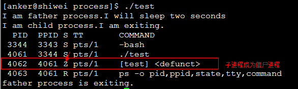
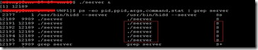
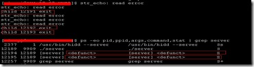

# 僵尸进程和孤儿进程

## 🖋 1、孤儿进程

孤儿进程，顾名思义，和现实生活中的孤儿有点类似，当一个进程的父进程结束时，但是它自己还没有结束，那么这个进程将会成为孤儿进程。最后孤儿进程将会被`init`进程（进程号为1）的进程收养，当然在子进程结束时也会由`init`进程完成对它的状态收集工作，因此一般来说，孤儿进程并不会有什么危害。

```c
#include <stdio.h>
#include <stdlib.h>
#include <errno.h>
#include <unistd.h>

int main(){
    pid_t pid;
    pid = fork(); //创建一个进程
    if (pid < 0){ //创建失败
        perror("fork error:");
        exit(1);
    }
    //子进程
    if (pid == 0){
        printf("I am the child process.\n");
        //输出进程ID和父进程ID
        printf("pid: %d\tppid:%d\n",getpid(),getppid());
        printf("I will sleep five seconds.\n");
        sleep(5); //睡眠5s，保证父进程先退出
        printf("pid: %d\tppid:%d\n",getpid(),getppid());
        printf("child process is exited.\n");
    }else{  //父进程
        printf("I am father process.\n");
        sleep(1); //父进程睡眠1s，保证子进程输出进程id
        printf("father process is  exited.\n");
    }
    return 0;
}
```


## 🖋 2、僵尸进程

僵尸进程是指：一个进程使用`fork`创建子进程，如果子进程退出，而父进程并没有调用`wait`或`waitpid`获取子进程的状态信息，那么子进程的某些信息如进程描述符仍然保存在系统中。这种进程称之为僵尸进程。

任何一个子进程\(`init`除外\)在`exit()`之后，并非马上就消失掉，而是留下一个称为僵尸进程\(Zombie\)的数据结构，等待父进程处理**。**这是每个子进程在结束时都要经过的阶段。如果子进程在`exit()`之后，父进程没有来得及处理，这时用`ps`命令就能看到子进程的状态是`“Z”`。如果父进程能及时 处理，可能用`ps`命令就来不及看到子进程的僵尸状态，但这并不等于子进程不经过僵尸状态。 如果父进程在子进程结束之前退出，则子进程将由`init`接管。`init`将会以父进程的身份对僵尸状态的子进程进行处理。

### \*\*\*\*🐹 **2.1、僵尸进程的危害**

僵尸进程会在系统中保留其某些信息如进程描述符、进程`id`等等。以进程`id`为例，系统中可用的`pid`是有限的，如果由于系统中大量的僵尸进程占用`pid`，就会导致因为没有可用的`pid`系统不能产生新的进程。

```c
#include <stdio.h>
#include <unistd.h>
#include <errno.h>
#include <stdlib.h>

int main(){
    pid_t pid;
    pid = fork();
    if (pid < 0){
        perror("fork error:");
        exit(1);
    }else if (pid == 0){
        printf("I am child process.I am exiting.\n");
        exit(0);
    }
    printf("I am father process.I will sleep two seconds\n");
    sleep(2); //等待子进程先退出
    //输出进程信息
    system("ps -o pid,ppid,state,tty,command");
    printf("father process is exiting.\n");
    return 0;
}
```



###  🐹 2.2、**僵尸进程解决办法**

#### \*\*\*\*🍈 2.2.**1、通过信号机制**

子进程退出时向父进程发送`SIGCHILD`信号，父进程处理`SIGCHILD`信号。在信号处理函数中调用`waitpid`进行处理僵尸进程。

```c
#include <stdio.h>
#include <unistd.h>
#include <errno.h>
#include <stdlib.h>
#include <signal.h>

static void sig_child(int signo);

int main(){
    pid_t pid;
    //创建捕捉子进程退出信号
    signal(SIGCHLD,sig_child);
    pid = fork();
    if (pid < 0){
        perror("fork error:");
        exit(1);
    }else if (pid == 0){
        printf("I am child process,pid id %d.I am exiting.\n",getpid());
        exit(0);
    }
    printf("I am father process.I will sleep two seconds\n");
    sleep(2); //等待子进程先退出
    //输出进程信息
    system("ps -o pid,ppid,state,tty,command");
    printf("father process is exiting.\n");
    return 0;
}

static void sig_child(int signo){
     pid_t pid;
     int stat;
     //处理僵尸进程
     while((pid = waitpid(-1, &stat, WNOHANG)) >0)
         printf("child %d terminated.\n", pid);
}
```


需要注意的是，捕获`SIGCHLD`信号并且调用`wait`来清理退出的进程，不能彻底避免产生僵尸进程.

**来看一种特殊的情况：**

假设有一个`client/server`的程序，对于每一个连接过来的`client`，`server`都启动一个新的进程去处理来自这个`client`的请求。然后有一个`client`进程，在这个进程内，发起了多个到`server`的请求（假设5个），则`server`会`fork` 5个子进程来读取`client`输入并处理（同时，当客户端关闭套接字的时候，每个子进程都退出）；当我们终止这个`client`进程的时候 ，内核将自动关闭所有由这个`client`进程打开的套接字，那么由这个`client`进程发起的5个连接基本在同一时刻终止。这就引发了5个`FIN`，每个连接一个。`server`端接受到这5个`FIN`的时候，5个子进程基本在同一时刻终止。这就又导致差不多在同一时刻递交5个`SIGCHLD`信号给父进程。

首先运行服务器程序，然后运行客户端程序，运用`ps`命令看以看到服务器`fork`了5个子进程，如图：



然后`Ctrl+C`终止客户端进程，在我机器上边测试，可以看到信号处理函数运行了3次，还剩下2个僵尸进程，如图：



通过上边这个实验我们可以看出，建立信号处理函数并在其中调用`wait`并不足以防止出现僵尸进程，其原因在于：所有5个信号都在信号处理函数执行之前产生，而信号处理函数只执行一次，因为`Unix`信号一般是不排队的。 更为严重的是，本问题是不确定的，依赖于客户`FIN`到达服务器主机的时机，信号处理函数执行的次数并不确定。

```c
//server.c
#include <stdio.h>
#include <stdlib.h>
#include <unistd.h>
#include <sys/socket.h>
#include <errno.h>
#include <error.h>
#include <netinet/in.h>
#include <netinet/ip.h>
#include <arpa/inet.h>
#include <string.h>
#include <signal.h>
#include <sys/wait.h>

typedef void sigfunc(int);

void func_wait(int signo) {
    pid_t pid;
    int stat;
    pid = wait(&stat);    
    printf( "child %d exit\n", pid );
    return;
}
void func_waitpid(int signo) {
    pid_t pid;
    int stat;
    while( (pid = waitpid(-1, &stat, WNOHANG)) > 0 ) {
        printf( "child %d exit\n", pid );
    }
    return;
}
sigfunc* signal( int signo, sigfunc *func ) {
    struct sigaction act, oact;
    act.sa_handler = func;
    sigemptyset(&act.sa_mask);
    act.sa_flags = 0;
    if ( signo == SIGALRM ) {
#ifdef            SA_INTERRUPT
        act.sa_flags |= SA_INTERRUPT;    /* SunOS 4.x */
#endif
    } else {
#ifdef           SA_RESTART
        act.sa_flags |= SA_RESTART;    /* SVR4, 4.4BSD */
#endif
    }
    if ( sigaction(signo, &act, &oact) < 0 ) {
        return SIG_ERR;
    }
    return oact.sa_handler;
} 


void str_echo( int cfd ) {
    ssize_t n;
    char buf[1024];
again:
    memset(buf, 0, sizeof(buf));
    while( (n = read(cfd, buf, 1024)) > 0 ) {
        write(cfd, buf, n); 
    }
    if( n <0 && errno == EINTR ) {
        goto again; 
    } else {
        printf("str_echo: read error\n");
    }
}

int main() {
    signal(SIGCHLD, &func_waitpid);    
    int s, c;
    pid_t child;
    if( (s = socket(AF_INET, SOCK_STREAM, 0)) < 0 ) {
        int e = errno; 
        perror("create socket fail.\n");
        exit(0);
    }
    struct sockaddr_in server_addr, child_addr; 
    bzero(&server_addr, sizeof(server_addr));
    server_addr.sin_family = AF_INET;
    server_addr.sin_port = htons(9998);
    server_addr.sin_addr.s_addr = htonl(INADDR_ANY);

    if( bind(s, (struct sockaddr *)&server_addr, sizeof(server_addr)) < 0 ) {
        int e = errno; 
        perror("bind address fail.\n");
        exit(0);
    }
    
    if( listen(s, 1024) < 0 ) {
        int e = errno; 
        perror("listen fail.\n");
        exit(0);
    }
    while(1) {
        socklen_t chilen = sizeof(child_addr); 
        if ( (c = accept(s, (struct sockaddr *)&child_addr, &chilen)) < 0 ) {
            perror("listen fail.");
            exit(0);
        }
        if( (child = fork()) == 0 ) {
            close(s); 
            str_echo(c);
            exit(0);
        }
        close(c);
    }
}

//client.c
#include <stdio.h>
#include <stdlib.h>
#include <unistd.h>
#include <sys/socket.h>
#include <errno.h>
#include <error.h>
#include <netinet/in.h>
#include <netinet/ip.h>
#include <arpa/inet.h>
#include <string.h>
#include <signal.h>

void str_cli(FILE *fp, int sfd ) {
    char sendline[1024], recvline[2014];
    memset(recvline, 0, sizeof(sendline));
    memset(sendline, 0, sizeof(recvline));
    while( fgets(sendline, 1024, fp) != NULL ) {
        write(sfd, sendline, strlen(sendline)); 
        if( read(sfd, recvline, 1024) == 0 ) {
            printf("server term prematurely.\n"); 
        }
        fputs(recvline, stdout);
        memset(recvline, 0, sizeof(sendline));
        memset(sendline, 0, sizeof(recvline));
    }
}

int main() {
    int s[5]; 
    for (int i=0; i<5; i++) {
        if( (s[i] = socket(AF_INET, SOCK_STREAM, 0)) < 0 ) {
            int e = errno; 
            perror("create socket fail.\n");
            exit(0);
        }
    }
    for (int i=0; i<5; i++) {
        struct sockaddr_in server_addr, child_addr; 
        bzero(&server_addr, sizeof(server_addr));
        server_addr.sin_family = AF_INET;
        server_addr.sin_port = htons(9998);
        inet_pton(AF_INET, "127.0.0.1", &server_addr.sin_addr);
        if( connect(s[i], (struct sockaddr *)&server_addr, sizeof(server_addr)) < 0 ) {
            perror("connect fail."); 
            exit(0);
        }
    }
    sleep(10);
    str_cli(stdin, s[0]);
    exit(0);
}
```

正确的解决办法是调用`waitpid`而不是`wait`，这个办法的方法为：信号处理函数中，在一个循环内调用`waitpid`，以获取所有已终止子进程的状态。我们必须指定`WNOHANG`选项，他告知`waitpid`在有尚未终止的子进程在运行时不要阻塞。（我们不能在循环内调用wait，因为没有办法防止 wait在尚有未终止的子进程在运行时阻塞，wait将会阻塞到现有的子进程中第一个终止为止），下边的程序分别给出了这两种处理办法 \(`func_wait`，`func_waitpid`\)。

#### \*\*\*\*🍈 **2.2.2、 `fork`两次**

原理是将子进程成为孤儿进程，从而其的父进程变为init进程，通过init进程可以处理僵尸进程。

```c
#include <stdio.h>
#include <stdlib.h>
#include <unistd.h>
#include <errno.h>

int main(){
    pid_t  pid;
    pid = fork(); //创建第一个子进程
    if (pid < 0){
        perror("fork error:");
        exit(1);
    }else if (pid == 0){ //第一个子进程
        //子进程再创建子进程
        printf("I am the first child process.pid:%d\tppid:%d\n",getpid(),getppid());
        pid = fork();
        if (pid < 0){
            perror("fork error:");
            exit(1);
        }else if (pid >0){ //第一个子进程退出
            printf("first procee is exited.\n");
            exit(0);
        }
        //第二个子进程
        //睡眠3s保证第一个子进程退出，这样第二个子进程的父亲就是init进程里
        sleep(3);
        printf("I am the second child process.pid: %d\tppid:%d\n",getpid(),getppid());
        exit(0);
    }
    //父进程处理第一个子进程退出
    if (waitpid(pid, NULL, 0) != pid){
        perror("waitepid error:");
        exit(1);
    }
    exit(0);
    return 0;
}
```


