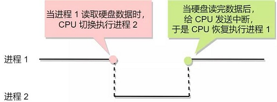

# 进程

操作系统一个很关键的概念就是进程（ Process）。进程是对正在运行中的程序的一个抽象，可以把进程看作是容纳运行一个程序所有信息的个容器。与每个进程相关的是**地址空间（address space）**，这是从某个最小值的存储位置（通常是零）到某个最大值的存储位置的列表。在这个地址空间中，进程可以进行读写操作。地址空间中存放有可执行程序，程序所需要的数据和它的栈。与每个进程相关的还有资源集，通常包括**寄存器（registers）**（寄存器一般包括**程序计数器（program counter**）和**堆栈指针（stack pointer）**）、打开文件的清单、突发的报警、有关的进程清单和其他需要执行程序的信息。进程是操作系统提供的最古老也是最重要的概念之一。即使可以使用的CPU只有一个，它们也支持（伪）并发操作，它们会将一个单独的CPU抽象为多个虚拟机的CPU。

> 伪并发：伪并行是指单核或多核处理器同时执行多个进程，从而使程序更快。 通过以非常有限的时间间隔在程序之间快速切换CPU，因此会产生并行感。缺点是CPU时间可能分配给下一个进程，也可能不分配给下一个进程。

## ✏ 1、进程模型

### 🖊 1.1、程序

**程序**是一个在时间上按严格次序前后相继的操作序列，这些操作是机器指令或高级语言编写的语句。

#### **特点：**

1. 顺序性：程序所规定的动作在机器上严格地按顺序执行。
2. 封闭性：资源的状态（除了初始状态外）只有程序本身的动作才能改变。
3. 确定性：程序执行结果与它的执行速度无关，也称为程序执行结果与时间无关性。即CPU在执行程序时，任意两个动作之间的停顿对程序的计算结果都不会产生影响。
4. 可再现性：如果程序执行在不同的时间执行，只要输入的初始条件相同，则无论何时重复执行该程序都会得到相同的结果。

#### 🖋 1.1.1、程序与进程

* **程序是指令和数据的集合，可以作为目标文件保存在磁盘中，或者作为段存放在内存地址空间中。**
* **进程是程序运行的一个具体的实例，程序总是运行在某个进程的上下文中。**

### 🖊 1.2、作业

 作业就是用户一次请求计算机系统为用户完成任务所做工作的总和。从系统的角度，可以将作业视为**程序、数据和作业说明书**构成的整体，即：**作业程序** + **数据（作业体）**+ **作业说明书（作业控制语言编写）。**其中，书写作业说明书的语言称为作业控制语言（JCL），是用户用于描述批处理作业处理过程控制意图的一种特殊程序，例如批处理文件。

> 批处理系统中，作业是抢占内存的基本单位，即以作业为单位将程序和数据调入内存

**作业说明书**：作业基本情况、作业控制、作业资源

* 作业基本情况：用户名、作业名、编程语言、最大处理时间等
* 作业控制描述：作业控制方式、作业步的操作顺序、作业执行出错处理
* 作业资源要求描述：处理时间、优先级、内存空间、外设类型和数量等

#### 🖋 1.2.1、作业的建立

作业的建立指的是一个作业的全部程序和数据输入到外存且在系统中建立了相应的作业控制块（job control block——JCB），也就是说，作业的建立包括

* 作业的输入
* 作业控制块的建立

系统为每个作业建立了 JCB，登记该作业所要求的资源情况、预计执行时间和执行优先级 

**包括：**

* 作业名以及状态
* 资源要求
* 作业控制方式

**作用：**

* 作业的唯一标识
* 通过 JCB 对作业进行控制和管理

**JCB 的创建和撤销：**

* 在作业进入后备状态时，由作业注册程序建立
* 当作业执行完毕时，由作业终止程序撤销

#### 🖋 1.2.2、作业的状态

* **提交**：作业由输入设备进入外存的过程
* **后备**：提交完成后，系统建立JCB，作为调度作业的依据，并将JCB 加入到后备作业队列
* **执行**：一个后备作业由作业调度程序选中并调入内存中，分配相应的资源后为其建立了相应的进程
* **完成**：当作业正常结束或因发生错误而终止时，作业进入完成状态

####  🖋 1.2.3、**作业与进程**

一个进程是一个程序对某个数据集的执行过程，是分配资源的基本单位。作业是用户需要计算机完成的某项任务，是要求计算机所做工作的集合。一个作业的完成要经过作业提交、作业收容、作业执行和作业完成4个阶段。而进程是对已提交完毕的程序所执行过程的描述，是资源分配的基本单位。其主要区别如下：

1. 作业是用户向计算机提交任务的任务实体。在用户向计算机提交作业后，系统将它放入外存中的作业等待队列中等待执行。而进程则是完成用户任务的执行实体，是向系统申请分配资源的基本单位。任一进程，只要它被创建，总有相应的部分存在于内存中。
2. 一个作业可由多个进程组成，且必须至少由一个进程组成，反过来则不成立。
3. 作业的概念主要用在批处理系统中，像UNIX这样的分时系统中就没有作业的概念。而进程的概念则用在几乎所有的多道程序系统中。

注：作业与进程最主要的区别是：前者是由用户提交，后者是由系统自动生成；前者以用户任务为单位，后者是操作系统控制的单位。

### 🖊 1.3、多道程序设计

为了提高计算机系统中各种资源的利用效率，缩短作业的周转时间，多种硬件资源能并行工作。

* 单CPU：并发程序按给定的时间片交替的在处理机上执行，其执行的时间是重叠的。
* 多CPU：这些并发程序在各自的处理机上运行。

**多道程序设计**就是允许多个程序同时进入内存并运行。**系统吞吐量**衡量系统效率的尺度。**吞吐量**是指单位时间内系统所处理的作业（程序）的道数（数量）。

> 如果系统的资源利用率高，则单位时间内所完成的有效工作多，吞吐量大。 如果系统的资源利用率低，则单位时间内所完成的有效工作少，吞吐量小。

**作用**：提高了设备资源利用率，内存资源利用率和处理机资源利用率，最终提高了系统吞吐量。

**特点：**

1. 独立性：每道程序都是在逻辑上独立的。
2. 随机性：程序和数据的输入与执行开始时间都是随机的。
3. 资源共享性：资源共享将导致对进程执行速度的制约。

#### 🖋 1.3.1、程序的并发执行

**程序的并发执行**是指两个或两个以上的程序在计算机系统中同处于已开始执行的且尚未结束的状态。能够参与并发执行的程序称为**并发程序**。

**特性：**

1. **并发程序在执行期间具有相互制约关系**：“执行-暂停-执行”。
2. **程序与计算不再一一对应**：允许多个用户作业调用一个共享程序段。
3. **并发程序执行结果不再可现**：宏观上是同时进行的，在单CPU系统中，他们仍是顺序执行。

#### 🖋 1.3.2、多道程序与进程模型

从系统允许多个程序同时进入CPU那一天开始，才有了进程的概念，它对CPU资源的抽象。我们把这种**多个程序同时运行在CPU的情况叫做多道程序**。举个例子，单一程序设计时，好比公交车上每次只能坐一个人，多道以后，就能坐多个人，有上有下。也是基于这样的设计思路，才有现在的各种貌似高端的技术。多道，跟中断，`DMA`，`SPOOLer`一并，被称为计算机操作系统发展史上里程碑一样的创造。

在进程模型中，所有计算机上运行的软件，通常也包括操作系统，被组织为若干顺序进程（sequential processes），简称为进程（process）。一个进程就是一个正在执行的程序的实例，进程也包括程序计数器、寄存器和变量的当前值。从概念上来说，每个进程都有各自的虚拟CPU，但是实际情况是CPU会在各个进程之间进行来回切换。

多道程序被抽象为拥有各自控制流程（即每个自己的程序计数器）的进程，并且每个程序都独立的运行。当然，实际上只有一个物理程序计数器，每个程序要运行时，其逻辑程序计数器装载到物理程序计数器中。当程序运行结束后，其物理程序计数器就会是真正的程序计数器，然后再把它放回进程的逻辑计数器中。在观察足够长的一段时间后，所有的进程都运行了，但在任何一个给定的瞬间仅有一个进程真正运行。

## ✏ 2、进程状态

## ✏ 3、进程的控制结构

## ✏ 4、进程控制

## ✏ 5、进程的上下文切换

