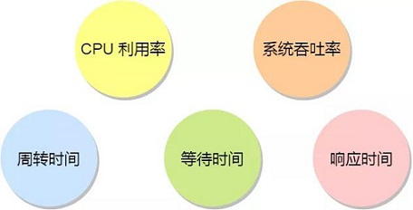

# 调度

## ✏ 2、调度

当一个计算机是多道程序设计系统时，会频繁的有很多进程或者线程来同时竞争CPU时间片。当两个或两个以上的进程或线程处于就绪状态时，就会发生这种情况。如果只有一个CPU可用，那么必须选择一个进程运行，这一功能是在操作系统中完成的，通常称为**调度程序**（scheduler）。该程序使用的算法叫做调度算法（ scheduling algorithm）。

### \*\*\*\*🖋 2.1、**调度时机**

在进程的生命周期中，当进程从一个运行状态到另外一状态变化的时候，其实会触发一次调度。比如，以下状态的变化都会触发操作系统的调度：

* _从就绪态 -&gt; 运行态_：当进程被创建时，会进入到就绪队列，操作系统会从就绪队列选择一个进程运行；
* _从运行态 -&gt; 阻塞态_：当进程发生 I/O 事件而阻塞时，操作系统必须选择另外一个进程运行；
* _从运行态 -&gt; 结束态_：当进程退出结束后，操作系统得从就绪队列选择另外一个进程运行；

因为，这些状态变化的时候，操作系统需要考虑是否要让新的进程给 CPU 运行，或者是否让当前进程从 CPU 上退出来而换另一个进程运行。另外，如果硬件时钟提供某个频率的周期性中断，那么可以根据如何处理时钟中断，把调度算法分为两类：

* **非抢占式调度算法**挑选一个进程，然后让该进程运行直到被阻塞，或者直到该进程退出，才会调用另外一个进程，也就是说不会理时钟中断这个事情。
* **抢占式调度算法**挑选一个进程，然后让该进程只运行某段时间，如果在该时段结束时，该进程仍然在运行时，则会把它挂起，接着调度程序从就绪队列挑选另外一个进程。这种抢占式调度处理，需要在时间间隔的末端发生**时钟中断**，以便把 CPU 控制返回给调度程序进行调度，也就是常说的**时间片机制**。

### \*\*\*\*🖋 2.2、**调度原则**

_原则一_：如果运行的程序，发生了 I/O 事件的请求，那 CPU 使用率必然会很低，因为此时进程在阻塞等待硬盘的数据返回。这样的过程，势必会造成 CPU 突然的空闲。所以，**为了提高 CPU 利用率，在这种发送 I/O 事件致使 CPU 空闲的情况下，调度程序需要从就绪队列中选择一个进程来运行。**

_原则二_：有的程序执行某个任务花费的时间会比较长，如果这个程序一直占用着 CPU，会造成系统吞吐量（CPU 在单位时间内完成的进程数量）的降低。所以，**要提高系统的吞吐率，调度程序要权衡长任务和短任务进程的运行完成数量。**

_原则三_：从进程开始到结束的过程中，实际上是包含两个时间，分别是进程运行时间和进程等待时间，这两个时间总和就称为周转时间。进程的周转时间越小越好，**如果进程的等待时间很长而运行时间很短，那周转时间就很长，这不是我们所期望的，调度程序应该避免这种情况发生。**

_原则四_：处于就绪队列的进程，也不能等太久，当然希望这个等待的时间越短越好，这样可以使得进程更快的在 CPU 中执行。所以，**就绪队列中进程的等待时间也是调度程序所需要考虑的原则。**

_原则五_：对于鼠标、键盘这种交互式比较强的应用，我们当然希望它的响应时间越快越好，否则就会影响用户体验了。所以，**对于交互式比较强的应用，响应时间也是调度程序需要考虑的原则。**

针对上面的五种调度原则，总结成如下：

* **CPU 利用率**：调度程序应确保 CPU 是始终匆忙的状态，这可提高 CPU 的利用率；
* **系统吞吐量**：吞吐量表示的是单位时间内 CPU 完成进程的数量，长作业的进程会占用较长的 CPU 资源，因此会降低吞吐量，相反，短作业的进程会提升系统吞吐量；
* **周转时间**：周转时间是进程运行和阻塞时间总和，一个进程的周转时间越小越好；
* **等待时间**：这个等待时间不是阻塞状态的时间，而是进程处于就绪队列的时间，等待的时间越长，用户越不满意；
* **响应时间**：用户提交请求到系统第一次产生响应所花费的时间，在交互式系统中，响应时间是衡量调度算法好坏的主要标准。

说白了，这么多调度原则，目的就是要使得进程要「快」。

### \*\*\*\*🖋 **2.3、调度算法**

不同的调度算法适用的场景也是不同的。在**单核 CPU 系统**中常见的调度算法如下。

#### 💎 2.3.1、先来先服务调度算法

最简单的一个调度算法，就是非抢占式的**先来先服务（**_**First Come First Severd, FCFS**_**）算法**了。

顾名思义，先来后到，**每次从就绪队列选择最先进入队列的进程，然后一直运行，直到进程退出或被阻塞，才会继续从队列中选择第一个进程接着运行。**

这似乎很公平，但是当一个长作业先运行了，那么后面的短作业等待的时间就会很长，不利于短作业。FCFS 对长作业有利，适用于 CPU 繁忙型作业的系统，而不适用于 I/O 繁忙型作业的系统。

