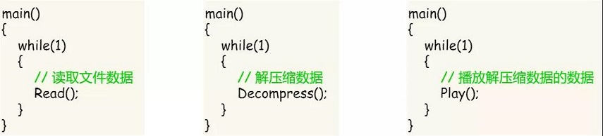
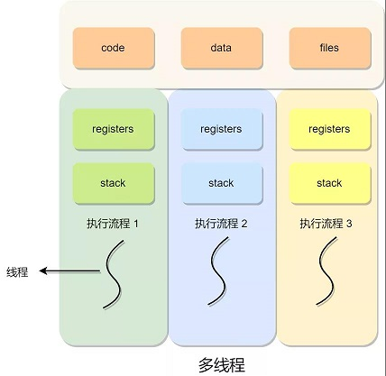

# 线程 & 协程

## ✏ **1、线程**

在早期的操作系统中都是以进程作为独立运行的基本单位，直到后面，计算机科学家们又提出了更小的能独立运行的基本单位，也就是**线程。**

**为什么需要线程？**

举个例子，假设你要编写一个视频播放器软件，那么该软件功能的核心模块有三个：

* 从视频文件当中读取数据；
* 对读取的数据进行解压缩；
* 把解压缩后的视频数据播放出来；

对于单进程的实现方式，实现方式如下：

对于单进程的这种方式，存在以下问题：

* 播放出来的画面和声音会不连贯，因为当 CPU 能力不够强的时候，`Read`  的时候可能进程就等在这了，这样就会导致等半天才进行数据解压和播放；
* 各个函数之间不是并发执行，影响资源的使用效率；

那改进成多进程的方式：

对于多进程的这种方式，依然会存在问题：

* 进程之间如何通信，共享数据？
* 维护进程的系统开销较大，如创建进程时，分配资源、建立 PCB；终止进程时，回收资源、撤销 PCB；进程切换时，保存当前进程的状态信息；

那到底如何解决呢？需要有一种新的实体，满足以下特性：

* 实体之间可以并发运行；
* 实体之间共享相同的地址空间；

这个新的实体，就是**线程\(** _**Thread**_ **\)**，线程之间可以并发运行且共享相同的地址空间**。**

**线程是进程当中的一条执行流程。**同一个进程内多个线程之间可以共享代码段、数据段、打开的文件等资源，但每个线程都有独立一套的寄存器和栈，这样可以确保线程的控制流是相对独立的。

### 🖋 **1.1、线程的优缺点**

线程的优点：

* 一个进程中可以同时存在多个线程；
* 各个线程之间可以并发执行；
* 各个线程之间可以共享地址空间和文件等资源；

线程的缺点：

* 当进程中的一个线程奔溃时，会导致其所属进程的所有线程奔溃。

举个例子，对于游戏的用户设计，则不应该使用多线程的方式，否则一个用户挂了，会影响其他同个进程的线程。

### 🖋 **1.2、线程和进程的比较**

线程与进程的比较如下：

* 进程是资源（包括内存、打开的文件等）分配的单位，线程是 CPU 调度的单位；
* 进程拥有一个完整的资源平台，而线程只独享必不可少的资源，如寄存器和栈；
* 线程同样具有就绪、阻塞、执行三种基本状态，同样具有状态之间的转换关系；
* 线程能减少并发执行的时间和空间开销；

对于，线程相比进程能减少开销，体现在：

* 线程的创建时间比进程快，因为进程在创建的过程中，还需要资源管理信息，比如内存管理信息、文件管理信息，而线程在创建的过程中，不会涉及这些资源管理信息，而是共享它们；
* 线程的终止时间比进程快，因为线程释放的资源相比进程少很多；
* 同一个进程内的线程切换比进程切换快，因为线程具有相同的地址空间（虚拟内存共享），这意味着同一个进程的线程都具有同一个页表，那么在切换的时候不需要切换页表。而对于进程之间的切换，切换的时候要把页表给切换掉，而页表的切换过程开销是比较大的；
* 由于同一进程的各线程间共享内存和文件资源，那么在线程之间数据传递的时候，就不需要经过内核了，这就使得线程之间的数据交互效率更高了；

所以，线程比进程不管是时间效率，还是空间效率都要高。

### \*\*\*\*🖋 **1.3、线程的上下文切换**

在前面我们知道了，线程与进程最大的区别在于：**线程是调度的基本单位，而进程则是资源拥有的基本单位**。所以，所谓操作系统的任务调度，实际上的调度对象是线程，而进程只是给线程提供了虚拟内存、全局变量等资源。

对于线程和进程，我们可以这么理解：

* 当进程只有一个线程时，可以认为进程就等于线程；
* 当进程拥有多个线程时，这些线程会共享相同的虚拟内存和全局变量等资源，这些资源在上下文切换时是不需要修改的；

另外，线程也有自己的私有数据，比如栈和寄存器等，这些在上下文切换时也是需要保存的。

> 线程上下文切换的是什么？

这还得看线程是不是属于同一个进程：

* 当两个线程不是属于同一个进程，则切换的过程就跟进程上下文切换一样；
* **当两个线程是属于同一个进程，因为虚拟内存是共享的，所以在切换时，虚拟内存这些资源就保持不动，只需要切换线程的私有数据、寄存器等不共享的数据**；

所以，线程的上下文切换相比进程，开销要小很多。

### \*\*\*\*🖋 1.4、**线程的实现**

主要有三种线程的实现方式：

* **用户线程（**_**User Thread**_**）**：在用户空间实现的线程，不是由内核管理的线程，是由用户态的线程库来完成线程的管理；
* **内核线程（**_**Kernel Thread**_**）**：在内核中实现的线程，是由内核管理的线程；
* **轻量级进程（**_**Light Weight Process**_**）**：在内核中来支持用户线程；

那么，这还需要考虑一个问题，用户线程和内核线程的对应关系。

首先，第一种关系是**多对一**的关系，也就是多个用户线程对应同一个内核线程：

