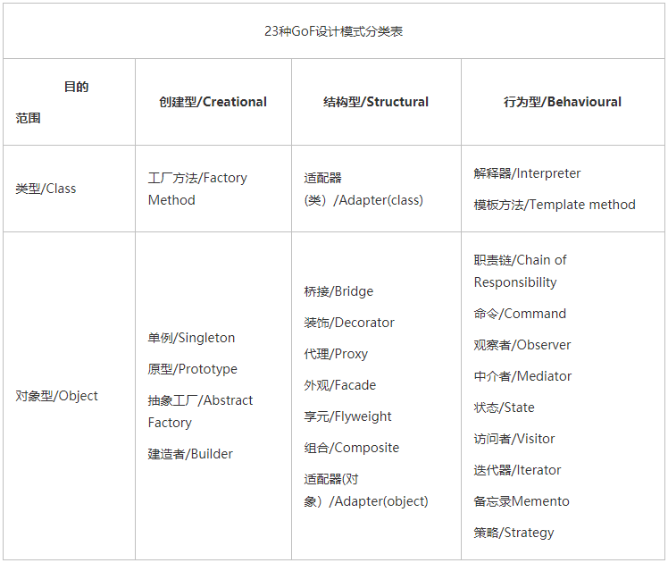

# 设计模式

## ✏ 设计原则：

### 1、依赖倒置原则（DIP）

依赖倒置原则（Dependence Inversion Principle，DIP）是 Object Mentor 公司总裁罗伯特·马丁（Robert C.Martin）于 1996 年在 [C++](http://c.biancheng.net/cplus/) Report 上发表的文章。

* 高层模块（稳定）不应该依赖于底层模块（变化），二者都应该依赖于抽象（稳定）。
* 抽象（稳定）不应该依赖于实现细节（变化），实现细节应该依赖于抽象（稳定）。

### 2、开放封闭原则（OCP）

开放封闭原则（Open Closed Principle，OCP）由勃兰特·梅耶（Bertrand Meyer）提出，他在 1988 年的著作《面向对象软件构造》（Object Oriented Software Construction）中提出：软件实体应当对扩展开放，对修改关闭（Software entities should be open for extension，but closed for modification），这就是开闭原则的经典定义。

* 对扩展开放，对更改封闭。
* 类模块应该是可扩展的，但是不可修改。

### 3、单一职责原则（SRP）

单一职责原则（Single Responsibility Principle，SRP）又称单一功能原则，由罗伯特·C.马丁（Robert C. Martin）于《敏捷软件开发：原则、模式和实践》一书中提出的。这里的职责是指类变化的原因，单一职责原则规定一个类应该有且仅有一个引起它变化的原因，否则类应该被拆分（There should never be more than one reason for a class to change）。

* 一个类应该仅有一个引起它变化的原因。
* 变化的方向隐含着类的责任。

### 4、Liskov 替换原则（LSP）

里氏替换原则（Liskov Substitution Principle，LSP）由麻省理工学院计算机科学实验室的里斯科夫（Liskov）女士在 1987 年的“面向对象技术的高峰会议”（OOPSLA）上发表的一篇文章《数据抽象和层次》（Data Abstraction and Hierarchy）里提出来的，她提出：继承必须确保超类所拥有的性质在子类中仍然成立（Inheritance should ensure that any property proved about supertype objects also holds for subtype objects）。

* 子类必须能够替换他们的基类（IS-A）。
* 继承表达类型抽象。

### 5、接口隔离原则（ISP）

接口隔离原则（Interface Segregation Principle，ISP）要求程序员尽量将臃肿庞大的接口拆分成更小的和更具体的接口，让接口中只包含客户感兴趣的方法。

* 不应该强迫客户程序依赖它们不用的方法。
* 接口应该小而完备。

### 6、优先使用对象组合，而不是类继承

合成复用原则（Composite Reuse Principle，CRP）又叫组合/聚合复用原则（Composition/Aggregate Reuse Principle，CARP）。它要求在软件复用时，要尽量先使用组合或者聚合等关联关系来实现，其次才考虑使用继承关系来实现。

* 类继承通常为“白箱复用”，对象组合通常为“黑箱复用”。
* 继承在某种程度上破坏了封装性，子类父类的耦合度高。
* 而对象组合则只要求被组合的对象具有良好定义的接口，耦合度低。

### 7、封装变化点

* 使用封装来创建对象之间的分界层，让设计者可以在分解层的一侧进行修改，而不会对另一侧产生不良的影响，从而实现层次间的松耦合。

### 8、针对接口编程，而不是针对实现编程

* 不将变量类型声明为某个特定的具体类，而是声明为某个接口。
* 客户程序无需获知对象的具体类型，只需要知道对象所具有的接口。
* 减少系统中各部分的依赖关系，从而实现“高内聚，松耦合”的类型设计方案。

面向接口设计：产业强盛的标志：接口标准化！

## ✏ 模式分类

从目的来看：

* 创建型（Creational）模式：将对象的部分创建工作延迟到子类或者其他对象，从而应对需求变化为对象创建时具体类型实现引来的冲击。
* 结构型（Structual）模式：通过类继承或者对象组合获得更灵活的结构，从而应对需求变化为对象的结构带来的冲击。
* 行为型（Behavioral）模式：通过类继承或者对象组合来划分类与对象间的职责，从而应对需求变化为多个交互的对象带来的冲击。

从范围来看：

* 类模式处理类与子类的静态关系
* 对象模式处理对象间的动态关系

## ✏ 重构

重构获得模式：Refactoring to Patterns

* 面向对象设计模式是“好的面向对象设计”，所谓“好的面向对象设计”指是那些可以满足“应对变化，提高服用”的设计。
* 现代软件设计的特征是“需求的频繁变化”。设计模式的要点是“寻找变化点，然后在变化点处应用设计模式，从而来更好地应对需求的变化”。“什么时候、什么地点应用设计模式”比“理解设计模式结构本身”更为重要。
* 设计模式的应用不宜先入为主，一上来就使用设计模式是对设计模式的最大误用。没有一步到位的设计模式。敏捷软件开发提倡的“Refactoring to Patterns”是目前普遍公认的最好的使用设计模式的方法。

重构关键技法：

* 静态-&gt;动态
* 早绑定-&gt;晚绑定
* 继承-&gt;组合
* 编译时依赖-&gt;运行时依赖
* 紧耦合-&gt;松耦合

## ✏ 资料

书籍：

* 《设计模式：可复用面向对象软件的基础》
* 《重构：改善既有代码的设计》
* 《重构与模式》

网站：

* [http://c.biancheng.net/design\_pattern/](http://c.biancheng.net/design_pattern/)
* [https://www.bilibili.com/video/BV1c4411a7wk](https://www.bilibili.com/video/BV1c4411a7wk)

